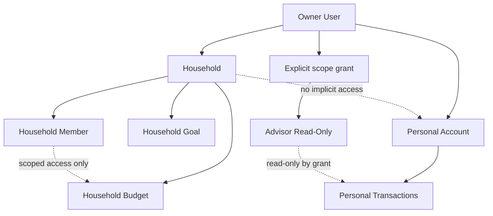
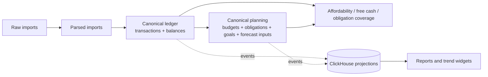

# Personal Finance OS Domain Specification

Version: 0.2.0  
Date: 2026-03-15  
Status: Domain authority

## 1. Purpose

This document defines tenancy, permissions, consent, canonical money semantics, lifecycle models, explainability requirements, UI state semantics, and retention rules for the full product.

## 2. Tenancy Model

### 2.1 Primary Boundary

The primary tenancy boundary is `user`.

Implications:
- imported statements belong to one owner user,
- accounts belong to one owner user,
- transactions belong to one owner user account,
- categories, merchant aliases, and corrections are owner-scoped unless explicitly shared.

### 2.2 Household Model

`Household` is an opt-in collaboration layer, not the default owner of personal finance truth.

Household may own:
- shared budgets,
- shared goals,
- shared obligations,
- shared dashboards.

Household does not automatically own:
- raw imports,
- personal accounts,
- personal transactions,
- Telegram identity bindings.

### 2.3 Ownership and Sharing Rules

Each domain resource must carry:
- `owner_type` in `user | household | system`
- `owner_id`

Sharing requires an explicit grant.
Household membership alone is not enough to expose account-level data.

### 2.4 Visibility Inheritance

- personal resource visibility starts with the owner user only,
- household resources are visible to members according to role and grant scope,
- advisor visibility is always explicit and read-only,
- realtime and Telegram fan-out must resolve the same scope model as REST reads.

### 2.5 Tenancy and Sharing Diagram

## 3. Access and Consent Model

### 3.1 Roles

| Role | Baseline permission |
| --- | --- |
| `owner` | full access to owned personal resources |
| `household_admin` | manage household membership and household-owned resources |
| `household_member` | interact with granted household resources |
| `advisor_readonly` | read-only on explicitly granted scopes |
| `service_worker` | internal scoped automation only |

### 3.2 Access Rule

Authorization is `role + ownership + resource scope + grant`.

`RBAC` alone is insufficient.
Every sensitive read or write must evaluate:
- who is acting,
- what resource is being accessed,
- who owns it,
- which scope grant exists,
- whether field masking applies.

### 3.3 Consent Grant Shape

Every share or delegation grant must define:
- `grant_id`
- `granter_user_id`
- `grantee_user_id`
- `resource_scope`
- `permissions`
- `field_masks`
- `expires_at`
- `revoked_at`

### 3.4 Consent Rules

- invites are created by the owner or household admin,
- the grantee must explicitly accept,
- grants are inactive until acceptance,
- revoke takes effect immediately for future reads, writes, WebSocket events, and Telegram commands,
- audit history remains after revoke, but direct data access does not,
- advisor grants cannot be escalated into edit permissions by Telegram or API shortcuts.

### 3.5 Consent Scope Grammar

Every `resource_scope` must be structured, not free-form.

Minimum grammar:
- `scope_type`
- `module`
- `target_kind`
- `target_id`
- `verbs`
- `field_masks`
- `constraints`

Supported `scope_type` values:
- `owner_all`
- `household_all`
- `module_all`
- `resource_kind`
- `resource_instance`
- `account`
- `account_group`

Rules:
- `target_id` is required for `resource_instance` and `account`,
- `verbs` must come from an allowlist such as `read`, `write`, `ack`, `manage`, `invite`,
- `field_masks` must be additive restrictions, never hidden write escalation,
- the most specific deny or mask wins on overlap,
- inherited scopes must be explicit; household membership alone does not imply account inheritance.

## 4. Rule Domain

### 4.1 Rule Ownership Model

Rules are first-class domain resources.
Each rule must carry:
- `owner_type` in `user | household | system`
- `owner_id`
- `rule_type`
- `subject_scope`
- `rule_definition_version`
- `evaluator_version`

V1 committed ownership:
- `system` rules for core overspend and anomaly evaluation,
- `user` rules for future watch-rule style personalization when enabled.

`household` rules are planned for shared workflows and must not be implied by personal rules.

### 4.2 Rule Types

Committed or near-term rule families:
- `overspend_threshold`
- `anomaly_amount`
- `anomaly_new_merchant`
- `merchant_watch`
- `recurring_charge_reminder`

Planned later:
- `obligation_due`
- `goal_risk`
- `digest_policy`
- `shared_household_watch`

### 4.3 Rule Input Contract

Every evaluation must declare:
- triggering event or schedule,
- canonical input references,
- owner scope,
- evaluation window,
- timezone,
- thresholds or parameters,
- suppression policy,
- dedup policy.

### 4.4 Dedup and Suppression Semantics

Every user-visible rule hit must use:
- `dedup_key`
- `dedup_window`
- `suppression_state`
- `suppression_reason`

Rules:
- identical hits within the active dedup window may increment counters but must not emit duplicate user-visible alerts,
- suppression may be temporal, actor-initiated, or state-based,
- suppression must not delete evaluation trace,
- recurring reminders must dedup until state changes or the configured reminder window rolls forward.

### 4.5 Watch Rules

A `watch rule` is a user-authored monitoring rule bound to a merchant, category, amount, or obligation-like subject.
It does not create or redefine canonical transaction truth.

### 4.6 Rule Evaluation Trace

Every rule hit must record:
- `rule_hit_id`
- `rule_id`
- `owner_scope`
- `input_references`
- `evaluator_version`
- `decision`
- `dedup_state`
- `suppression_state`
- emitted alert or notification identifiers if any.

### 4.7 Rule Logic Versioning

- `rule_definition_version` tracks user- or system-visible rule configuration,
- `evaluator_version` tracks execution logic,
- rule behavior changes must be auditable across both versions.

## 5. Canonical Money Model

### 5.1 Canonical Money Entities

Canonical money truth is composed of:
- `Account`
- `BalanceSnapshot`
- `Transaction`
- `TransactionCorrection`
- `Obligation`
- `Budget`
- `Goal`
- `ForecastSnapshot`

MongoDB parse artifacts, ClickHouse projections, detected recurring candidates, and transfer suggestions are not canonical money truth.

### 5.2 Inferred Recurring vs Canonical Obligations

`DetectedRecurringPattern` is an inferred, explainable, revisable artifact derived from transactions.
It is not canonical money truth.

`Obligation` becomes canonical planning state only when:
- explicitly created by the user,
- confirmed from a recurring pattern,
- or created by a committed system workflow with audit trace.

The system must never present a detected recurring pattern as a confirmed obligation without explicit state transition.

### 5.3 Account Classification Model

Every account must carry:
- `account_type`
- `liquidity_class`
- `planning_scope`

Supported `account_type` values:
- `checking`
- `savings`
- `cash`
- `credit`
- `loan`
- `brokerage`
- `e_wallet`
- `crypto`
- `prepaid`

Supported `liquidity_class` values:
- `liquid`
- `semi_liquid`
- `illiquid`
- `debt`

Supported `planning_scope` values:
- `included`
- `excluded`
- `user_configurable`

Rules:
- `credit` and `loan` default to `debt`,
- `brokerage` defaults to `semi_liquid`,
- `crypto` defaults to `semi_liquid` unless promoted by future policy,
- negative balances reduce available liquidity when the account is in planning scope,
- credit lines do not count as `liquid_cash_now` unless an explicit future product policy allows it.

### 5.4 Transaction Semantics

Every transaction must have:
- owner user,
- account,
- monetary direction,
- classification in `income | expense | transfer | refund | adjustment`,
- lifecycle status in `pending | posted | reversed | excluded`,
- source trace.

Rules:
- `reversed` negates the business effect of the original transaction,
- `excluded` removes the transaction from planning and analytics,
- `transfer` never counts as spend,
- `refund` offsets spend in the linked or assigned category,
- manual corrections append history; they do not erase lineage.

### 5.5 Balance Truth

Per account, the system may store:
- `reported_available_balance`
- `reported_book_balance`
- `derived_book_balance`
- `balance_confidence`
- `balance_as_of`

Priority for `usable_balance`:
1. fresh `reported_available_balance`
2. fresh `reported_book_balance`
3. trusted `derived_book_balance`
4. `unknown`

If `usable_balance` is `unknown` for an in-scope liquid account, affordability and reserve decisions must degrade to `insufficient_data`.

### 5.6 Multi-Currency Model

Every account and transaction stores money in native currency.

Cross-currency features must additionally define:
- `base_currency` per user,
- `fx_source`,
- `fx_as_of`,
- `fx_rate_set_id` or equivalent traceable reference,
- rounding policy.

Rules:
- converted planning and wealth outputs must disclose FX freshness,
- decision-oriented features require fresh FX for non-base balances or must return `partial`, `stale`, or `insufficient_data`,
- converted aggregates are rounded at presentation time unless a business rule requires stored rounded output,
- if FX data is unavailable, native-currency values remain canonical and converted decision outputs must degrade safely.

### 5.7 Transfer Detection

Transfer classification follows this priority:

1. explicit parser or source signal
2. confirmed linked-account transfer mapping
3. heuristic transfer detection with explanation and confidence
4. unresolved ambiguity remains non-canonical suggestion, not auto-classified transfer

Rules:
- heuristic transfer suggestions must not silently rewrite spend truth without sufficient confidence or confirmation,
- transfer-related bank fees remain separate expense transactions,
- card repayment, cash withdrawal, wallet top-up, brokerage funding, and own-bank transfer flows must preserve traceability between legs when known.

### 5.8 Canonical Planning Values

Canonical values are defined as follows:

- `liquid_cash_now`
  sum of `usable_balance` over `liquid` in-scope accounts in user base currency using fresh FX when needed

- `budget_spend`
  sum of `posted` expense transactions in the budget window
  minus linked or assigned refunds
  excluding transfers, reversed transactions, and excluded transactions

- `forecast_surplus_end_of_window`
  `starting_liquid_cash + expected_inflows - expected_outflows - reserve_floor`

- `free_cash_now`
  `liquid_cash_now - reserve_floor`

- `obligation_coverage`
  ability to fund active due obligations from liquid cash and forecast inflows within the selected window

### 5.9 Forecast Inputs

Forecasting may use only:
- canonical balances,
- canonical transactions,
- recurring income,
- recurring obligations,
- planned expenses,
- active goals,
- explicit reserve floor.

If critical inputs are missing, the forecast must return reduced `data_completeness` or `insufficient_data`.

### 5.10 Forecast Window Semantics

Every forecast must declare:
- `window_type`
- `window_start`
- `window_end`

Supported `window_type` values:
- `to_month_end`
- `next_30_days`
- `to_next_income_event`
- `custom`

Rules:
- V1 default is `to_month_end`,
- `to_next_income_event` is allowed only when income timing is known with sufficient confidence,
- affordability and shortfall outputs must name the window used.

### 5.11 Affordability Rule

`Can I afford this?` may only return a confident yes or no when:
- `usable_balance` is known for planning accounts,
- due obligations are known for the forecast window,
- reserve floor is known,
- forecast completeness is above the configured threshold.

Otherwise the result must be:
- `insufficient_data`, or
- `answer_with_low_confidence`

### 5.12 Wealth Readiness Gate

Wealth-readiness assessment requires:
- liquid balance coverage,
- obligation coverage,
- essential-spend baseline,
- reserve-floor definition,
- debt visibility where applicable.

If any required input is missing or stale, the system must not claim investment readiness.

### 5.13 Canonical Money Decision Flow

## 6. Hard Invariants

- a transaction must belong to exactly one owner user and one account,
- account owner must equal transaction owner,
- raw imports must never be owned directly by household resources,
- revoked grants must invalidate future live access for that scope,
- excluded transactions must not contribute to `budget_spend`,
- reversed transactions must not be counted twice in planning or analytics,
- a detected recurring pattern must not become a canonical obligation without explicit transition,
- a rule hit must preserve evaluation trace even when deduplicated or suppressed,
- an obligation marked `paid` must have payment evidence or explicit manual confirmation,
- every forecast snapshot must declare source ranges, completeness, and freshness,
- every decision feature using FX must disclose FX freshness or degrade safely.

## 7. Lifecycle State Models

| Entity | Required states |
| --- | --- |
| `StatementImport` | `received -> stored -> queued -> parsing`, then `manual_review` or `parsed -> applied -> archived`, with `failed` as terminal exception |
| `Notification` | `created -> queued -> sending`, then `delivered` or `failed_retryable -> failed_terminal`, with optional `acknowledged` or `suppressed` |
| `Goal` | `draft -> active -> paused`, then `achieved` or `cancelled` |
| `ForecastSnapshot` | `requested -> computing -> ready -> stale -> superseded`, with `failed` as error state |
| `Rule` | `draft -> active -> muted -> disabled -> archived` |
| `Obligation` | `proposed -> active -> due -> overdue`, then `paid`, `skipped`, or `cancelled` |
| `CalendarSyncJob` | `queued -> running -> succeeded`, or `failed_retryable` / `failed_terminal` |

Implementation may define operational substates, but it must not violate these business states.

## 8. Explainability Contract

| Output type | Required explanation fields |
| --- | --- |
| Category classification | `explanation_type`, `source_rule_id`, `matched_fields`, `confidence`, `fallback_reason` |
| Alert or anomaly | `trigger_rule_id`, `baseline_window`, `threshold`, `actual_value`, `related_transaction_ids` |
| Forecast | `window_start`, `window_end`, `starting_cash_source`, `included_inflows`, `included_outflows`, `reserve_floor`, `confidence`, `missing_inputs` |
| Goal affordability | `goal_id`, `assumed_contribution_rate`, `forecast_dependency`, `liquidity_impact`, `blocking_constraints` |
| Transfer suggestion | `detection_source`, `linked_account_refs`, `confidence`, `reason_not_canonical` |

`Explainability before magic` is satisfied only when these fields are present or the output is explicitly marked `not_explainable`.

## 9. UI and API Data State Semantics

Every major read model or dashboard panel must be able to represent:

- `empty`: no relevant data exists yet
- `loading`: request accepted or recomputation in progress
- `ready`: complete and fresh enough for intended use
- `partial`: some inputs missing, but a limited view is still useful
- `stale`: data exists, but freshness target exceeded
- `error`: last attempt failed and no safe fallback is available

Required metadata for `partial` or `stale` states:
- `computed_at`
- `missing_inputs`
- `freshness_status`
- `next_retry_at` when applicable

## 10. Retention and Deletion Rules

| Data | Rule |
| --- | --- |
| Raw imports | retain for `365` days by default or delete earlier on owner request unless blocked by active recovery or audit workflow |
| Failed imports and manual-review artifacts | retain for `30` days unless promoted into a confirmed correction record |
| Canonical transactions, obligations, goals, budgets | retain until account or user deletion workflow; support soft delete plus auditable lineage |
| Telegram, calendar, and broker bindings | revoke immediately on disconnect and remove tokens or secrets as part of the same workflow |
| Access grants and audit records | retain for at least `365` days after revoke |
| ClickHouse projections, forecast snapshots, notification histories, research-linked user artifacts, and WebSocket presence state | must be invalidated, deleted, or anonymized through derived-data propagation after canonical hard delete |

Hard-delete workflows must define:
- what is erased from canonical stores,
- what is anonymized in retained audit artifacts,
- how derived stores are purged,
- how retained event streams honor deletion policy,
- completion SLA for deletion propagation.
