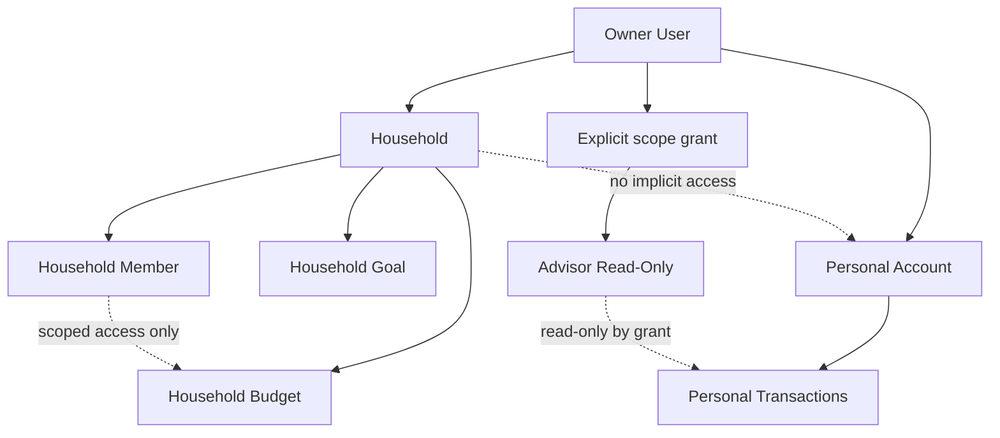
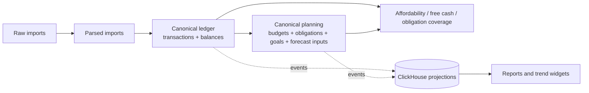

# Personal Finance OS Domain Specification

Version: 0.2.0  
Date: 2026-03-15  
Status: Domain authority

## 1. Purpose

This document defines tenancy, permissions, consent, canonical money semantics, lifecycle models, explainability requirements, UI state semantics, and retention rules for the full product.

## 2. Tenancy Model

### 2.1 Primary Boundary

The primary tenancy boundary is `user`.

Implications:
- imported statements belong to one owner user,
- accounts belong to one owner user,
- transactions belong to one owner user account,
- categories, merchant aliases, and corrections are owner-scoped unless explicitly shared.

### 2.2 Household Model

`Household` is an opt-in collaboration layer, not the default owner of personal finance truth.

Household may own:
- shared budgets,
- shared goals,
- shared obligations,
- shared dashboards.

Household does not automatically own:
- raw imports,
- personal accounts,
- personal transactions,
- Telegram identity bindings.

### 2.3 Ownership and Sharing Rules

Each domain resource must carry:
- `owner_type` in `user | household | system`
- `owner_id`

Sharing requires an explicit grant.
Household membership alone is not enough to expose account-level data.

### 2.4 Visibility Inheritance

- personal resource visibility starts with the owner user only,
- household resources are visible to members according to role and grant scope,
- advisor visibility is always explicit and read-only,
- realtime and Telegram fan-out must resolve the same scope model as REST reads.

### 2.5 Tenancy and Sharing Diagram

## 3. Access and Consent Model

### 3.1 Roles

| Role | Baseline permission |
| --- | --- |
| `owner` | full access to owned personal resources |
| `household_admin` | manage household membership and household-owned resources |
| `household_member` | interact with granted household resources |
| `advisor_readonly` | read-only on explicitly granted scopes |
| `service_worker` | internal scoped automation only |

### 3.2 Access Rule

Authorization is `role + ownership + resource scope + grant`.

`RBAC` alone is insufficient.
Every sensitive read or write must evaluate:
- who is acting,
- what resource is being accessed,
- who owns it,
- which scope grant exists,
- whether field masking applies.

### 3.3 Consent Grant Shape

Every share or delegation grant must define:
- `grant_id`
- `granter_user_id`
- `grantee_user_id`
- `resource_scope`
- `permissions`
- `field_masks`
- `expires_at`
- `revoked_at`

### 3.4 Consent Rules

- invites are created by the owner or household admin,
- the grantee must explicitly accept,
- grants are inactive until acceptance,
- revoke takes effect immediately for future reads, writes, WebSocket events, and Telegram commands,
- audit history remains after revoke, but direct data access does not,
- advisor grants cannot be escalated into edit permissions by Telegram or API shortcuts.

## 4. Canonical Money Model

### 4.1 Canonical Money Entities

Canonical money truth is composed of:
- `Account`
- `BalanceSnapshot`
- `Transaction`
- `TransactionCorrection`
- `RecurringPattern`
- `Obligation`
- `Budget`
- `Goal`
- `ForecastSnapshot`

MongoDB parse artifacts and ClickHouse projections are not canonical money truth.

### 4.2 Transaction Semantics

Every transaction must have:
- owner user,
- account,
- monetary direction,
- classification in `income | expense | transfer | refund | adjustment`,
- lifecycle status in `pending | posted | reversed | excluded`,
- source trace.

Rules:
- `reversed` negates the business effect of the original transaction,
- `excluded` removes the transaction from planning and analytics,
- `transfer` never counts as spend,
- `refund` offsets spend in the linked or assigned category,
- manual corrections append history; they do not erase lineage.

### 4.3 Balance Truth

Per account, the system may store:
- `reported_available_balance`
- `reported_book_balance`
- `derived_book_balance`
- `balance_confidence`
- `balance_as_of`

Priority for `usable_balance`:
1. fresh `reported_available_balance`
2. fresh `reported_book_balance`
3. trusted `derived_book_balance`
4. `unknown`

If `usable_balance` is `unknown` for an in-scope liquid account, affordability and reserve decisions must degrade to `insufficient_data`.

### 4.4 Canonical Planning Values

Canonical values are defined as follows:

- `liquid_cash_now`
  sum of `usable_balance` over liquid in-scope accounts

- `budget_spend`
  sum of `posted` expense transactions in the budget window
  minus linked or assigned refunds
  excluding transfers, reversed transactions, and excluded transactions

- `forecast_surplus_end_of_window`
  `starting_liquid_cash + expected_inflows - expected_outflows - reserve_floor`

- `free_cash_now`
  `liquid_cash_now - reserve_floor`

- `obligation_coverage`
  ability to fund active due obligations from liquid cash and forecast inflows within the selected window

### 4.5 Forecast Inputs

Forecasting may use only:
- canonical balances,
- canonical transactions,
- recurring income,
- recurring obligations,
- planned expenses,
- active goals,
- explicit reserve floor.

If critical inputs are missing, the forecast must return reduced `data_completeness` or `insufficient_data`.

### 4.6 Affordability Rule

`Can I afford this?` may only return a confident yes or no when:
- `usable_balance` is known for planning accounts,
- due obligations are known for the forecast window,
- reserve floor is known,
- forecast completeness is above the configured threshold.

Otherwise the result must be:
- `insufficient_data`, or
- `answer_with_low_confidence`

### 4.7 Wealth Readiness Gate

Wealth-readiness assessment requires:
- liquid balance coverage,
- obligation coverage,
- essential-spend baseline,
- reserve-floor definition,
- debt visibility where applicable.

If any required input is missing or stale, the system must not claim investment readiness.

### 4.8 Canonical Money Decision Flow

## 5. Lifecycle State Models

| Entity | Required states |
| --- | --- |
| `StatementImport` | `received -> stored -> queued -> parsing`, then `manual_review` or `parsed -> applied -> archived`, with `failed` as terminal exception |
| `Notification` | `created -> queued -> sending`, then `delivered` or `failed_retryable -> failed_terminal`, with optional `acknowledged` or `suppressed` |
| `Goal` | `draft -> active -> paused`, then `achieved` or `cancelled` |
| `ForecastSnapshot` | `requested -> computing -> ready -> stale -> superseded`, with `failed` as error state |
| `Rule` | `draft -> active -> muted -> disabled -> archived` |
| `Obligation` | `proposed -> active -> due -> overdue`, then `paid`, `skipped`, or `cancelled` |
| `CalendarSyncJob` | `queued -> running -> succeeded`, or `failed_retryable` / `failed_terminal` |

Implementation may define operational substates, but it must not violate these business states.

## 6. Explainability Contract

| Output type | Required explanation fields |
| --- | --- |
| Category classification | `explanation_type`, `source_rule_id`, `matched_fields`, `confidence`, `fallback_reason` |
| Alert or anomaly | `trigger_rule_id`, `baseline_window`, `threshold`, `actual_value`, `related_transaction_ids` |
| Forecast | `window_start`, `window_end`, `starting_cash_source`, `included_inflows`, `included_outflows`, `reserve_floor`, `confidence`, `missing_inputs` |
| Goal affordability | `goal_id`, `assumed_contribution_rate`, `forecast_dependency`, `liquidity_impact`, `blocking_constraints` |

`Explainability before magic` is satisfied only when these fields are present or the output is explicitly marked `not_explainable`.

## 7. UI and API Data State Semantics

Every major read model or dashboard panel must be able to represent:

- `empty`: no relevant data exists yet
- `loading`: request accepted or recomputation in progress
- `ready`: complete and fresh enough for intended use
- `partial`: some inputs missing, but a limited view is still useful
- `stale`: data exists, but freshness target exceeded
- `error`: last attempt failed and no safe fallback is available

Required metadata for `partial` or `stale` states:
- `computed_at`
- `missing_inputs`
- `freshness_status`
- `next_retry_at` when applicable

## 8. Retention and Deletion Rules

| Data | Rule |
| --- | --- |
| Raw imports | retain for `365` days by default or delete earlier on owner request unless blocked by active recovery or audit workflow |
| Failed imports and manual-review artifacts | retain for `30` days unless promoted into a confirmed correction record |
| Canonical transactions, obligations, goals, budgets | retain until account or user deletion workflow; support soft delete plus auditable lineage |
| Telegram, calendar, and broker bindings | revoke immediately on disconnect and remove tokens or secrets as part of the same workflow |
| Access grants and audit records | retain for at least `365` days after revoke |

Hard-delete workflows must define what is erased, what is anonymized, and what remains as audit metadata.
