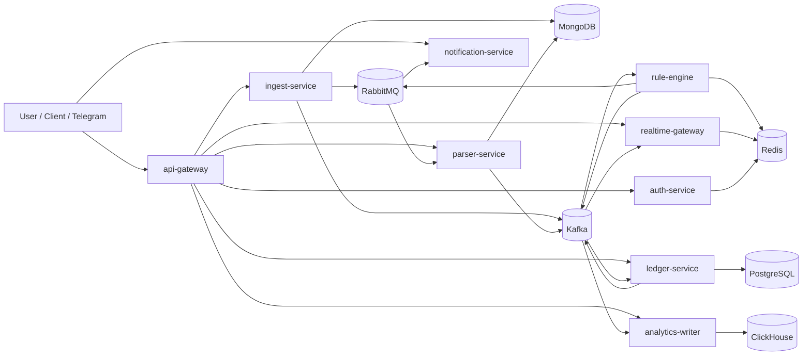
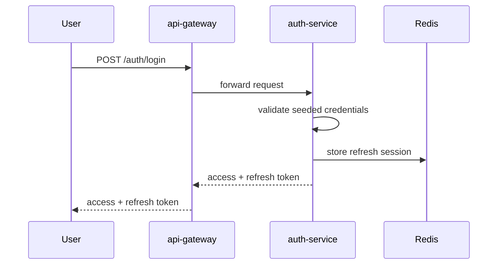
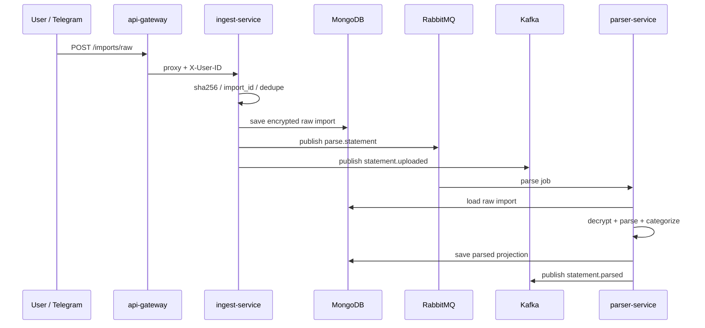
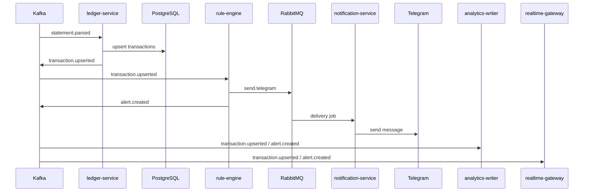

# Personal Finance OS: Current Implementation Status

Version: 0.1.0  
Date: 2026-03-17  
Status: V1 core implemented

## 1. Purpose

This document describes the current factual implementation state of `Personal Finance OS`.
It answers two questions:
- what is already implemented,
- how the implemented parts work together in runtime.

This is not a target architecture document.
For target scope and product boundaries, see:
- [V1 Specification](v1-spec.md)
- [Master Specification](master-spec.md)
- [Product Architecture Specification](product-architecture-spec.md)

## 2. Current Result

The project already contains a working V1 backend platform with:
- external API gateway,
- authentication with JWT and refresh sessions,
- raw statement import,
- asynchronous parsing,
- ledger persistence,
- event-driven rule evaluation,
- Telegram notifications,
- analytics projections,
- realtime delivery,
- Docker-based local environment,
- automated tests and CI baseline.

In practical terms, the following end-to-end chain works:

```text
api-gateway
  -> auth-service
  -> ingest-service
  -> parser-service
  -> ledger-service
  -> rule-engine
  -> notification-service
  -> analytics-writer
  -> realtime-gateway
```

## 3. Implemented Architecture

### 3.1 Runtime Topology



### 3.2 Technology Use by Role

| Technology | Current role |
| --- | --- |
| `Go` | all services |
| `PostgreSQL` | canonical ledger transactions and categories |
| `MongoDB` | raw imports and parsed projections |
| `Redis` | refresh sessions, rule state, realtime presence |
| `RabbitMQ` | parse jobs and Telegram notification jobs |
| `Kafka` | domain event backbone |
| `ClickHouse` | analytical projections |
| `REST` | external API surface |
| `WebSocket` | realtime dashboard transport |
| `Docker Compose` | local orchestration |
| `Prometheus` | metrics scraping config |
| `Grafana` | local observability dashboard container |

## 4. Implemented Services

### 4.1 api-gateway

Implemented in:
- [cmd/api-gateway/main.go](../cmd/api-gateway/main.go)

What it does now:
- acts as the single external REST entrypoint,
- validates JWT access tokens on protected routes,
- forwards identity to downstream services through `X-User-ID` and role headers,
- strips user-controlled `user_id` query overrides before proxying,
- exposes the external WebSocket entrypoint,
- proxies to:
  - `auth-service`
  - `ingest-service`
  - `parser-service`
  - `ledger-service`
  - `analytics-writer`
  - `realtime-gateway`
  - selected `notification-service` endpoints.

### 4.2 auth-service

Implemented in:
- [cmd/auth-service/main.go](../cmd/auth-service/main.go)
- [internal/auth/service.go](../internal/auth/service.go)

What it does now:
- authenticates seeded demo users,
- issues JWT access and refresh token pairs,
- stores refresh sessions in Redis,
- rotates refresh sessions,
- returns current user info,
- provides internal identity verification used by Telegram login binding.

### 4.3 ingest-service

Implemented in:
- [cmd/ingest-service/main.go](../cmd/ingest-service/main.go)
- [internal/imports/models.go](../internal/imports/models.go)

What it does now:
- accepts multipart file upload,
- requires authenticated user context from header,
- computes `sha256` and derives `import_id`,
- provides idempotent duplicate handling,
- stores raw import metadata in MongoDB,
- encrypts raw file content before storing it in MongoDB,
- publishes parse job to RabbitMQ,
- publishes `statement.uploaded` to Kafka,
- exposes import status retrieval,
- supports duplicate recovery flow for partially processed imports.

### 4.4 parser-service

Implemented in:
- [cmd/parser-service/main.go](../cmd/parser-service/main.go)
- [internal/parser/parser.go](../internal/parser/parser.go)
- [internal/parser/pdf.go](../internal/parser/pdf.go)
- [internal/parser/categorizer.go](../internal/parser/categorizer.go)

What it does now:
- consumes parse jobs asynchronously from RabbitMQ,
- loads raw import from MongoDB,
- decrypts encrypted raw content,
- parses:
  - `CSV`
  - text-based `PDF`
- normalizes transactions,
- applies initial merchant/category heuristics,
- stores parsed projection in MongoDB,
- emits `statement.parsed` to Kafka,
- keeps parsing idempotent by `import_id`,
- removes `raw_line` from new parsed records to avoid spreading sensitive raw statement text.

### 4.5 ledger-service

Implemented in:
- [cmd/ledger-service/main.go](../cmd/ledger-service/main.go)
- [internal/ledger/domain.go](../internal/ledger/domain.go)
- [internal/ledger/postgres.go](../internal/ledger/postgres.go)

What it does now:
- consumes `statement.parsed` from Kafka,
- loads parsed projection from MongoDB,
- transforms parsed transactions into canonical ledger transactions,
- writes transactions into PostgreSQL,
- deduplicates imported transactions by `user_id + source_import_id + fingerprint`,
- exposes:
  - transaction listing,
  - manual transaction creation,
  - category listing,
  - recurring detection,
- emits `transaction.upserted` to Kafka,
- enforces authenticated user context for HTTP access,
- rejects client-supplied `user_id`, `id`, `fingerprint`, and other hidden storage fields,
- requires `Idempotency-Key` for manual create path.

### 4.6 rule-engine

Implemented in:
- [cmd/rule-engine/main.go](../cmd/rule-engine/main.go)
- [internal/rules/engine.go](../internal/rules/engine.go)
- [internal/rules/store.go](../internal/rules/store.go)

What it does now:
- consumes `transaction.upserted` from Kafka,
- keeps rule state in Redis,
- detects:
  - large transaction anomaly,
  - new merchant anomaly,
  - overspend thresholds,
- deduplicates repeated alerts inside active windows,
- publishes `send.telegram` jobs to RabbitMQ,
- publishes `alert.created` to Kafka,
- already includes anti-spam tuning for statement imports.

### 4.7 notification-service

Implemented in:
- [cmd/notification-service/main.go](../cmd/notification-service/main.go)
- [cmd/notification-service/telegram.go](../cmd/notification-service/telegram.go)
- [internal/telegramauth/store.go](../internal/telegramauth/store.go)

What it does now:
- consumes Telegram delivery jobs from RabbitMQ,
- retries failed deliveries,
- routes exhausted failures to DLQ,
- sends real Telegram messages when bot token/chat configuration is present,
- supports Telegram long polling,
- supports Russian bot responses,
- supports Telegram login binding:
  - `/login`
  - `/logout`
  - `/whoami`
- supports reporting commands:
  - `/help`
  - `/status`
  - `/report`
  - `/alerts`
  - `/transactions`
- accepts Telegram document uploads,
- forwards supported files to `ingest-service`,
- waits for parsed result and sends follow-up parse summary back to the chat.

### 4.8 analytics-writer

Implemented in:
- [cmd/analytics-writer/main.go](../cmd/analytics-writer/main.go)
- [internal/platform/clickhousex/clickhouse.go](../internal/platform/clickhousex/clickhouse.go)

What it does now:
- consumes:
  - `transaction.upserted`
  - `alert.created`
- creates ClickHouse analytical tables on startup,
- writes analytical projections,
- exposes analytics endpoints for:
  - projections summary,
  - daily spend,
  - alerts,
- enforces authenticated user context for analytical queries.

### 4.9 realtime-gateway

Implemented in:
- [cmd/realtime-gateway/main.go](../cmd/realtime-gateway/main.go)
- [internal/platform/ws/hub.go](../internal/platform/ws/hub.go)
- [internal/realtime/presence.go](../internal/realtime/presence.go)
- [internal/realtime/events.go](../internal/realtime/events.go)

What it does now:
- consumes realtime-relevant Kafka events,
- exposes WebSocket endpoint,
- supports channel subscriptions,
- fans out live dashboard, alert, and transaction updates,
- stores presence and subscription state in Redis,
- exposes presence/config endpoints.

## 5. Implemented Product Flows

### 5.1 Auth Flow



### 5.2 Statement Import Flow



### 5.3 Ledger and Alerts Flow



## 6. Current Security Implementation

### 6.1 Identity and Access Control

Implemented now:
- JWT access token validation in gateway,
- refresh-token session validation in Redis,
- downstream identity propagation through headers,
- downstream services enforce authenticated `X-User-ID`,
- user-controlled `?user_id=` overrides are rejected or stripped,
- strict JSON decoding rejects hidden/unknown fields,
- manual ledger create no longer trusts client-supplied storage fields.

Relevant code:
- [internal/platform/jwtx/middleware.go](../internal/platform/jwtx/middleware.go)
- [internal/platform/userctx/userctx.go](../internal/platform/userctx/userctx.go)
- [internal/platform/httpx/httpx.go](../internal/platform/httpx/httpx.go)

### 6.2 Sensitive Data Protection

Implemented now:
- raw statement content is encrypted before storing in MongoDB,
- parser decrypts raw content only for processing,
- new parsed projections do not keep `raw_line`,
- bot status responses no longer expose internal service URLs.

Relevant code:
- [internal/platform/cryptox/cryptox.go](../internal/platform/cryptox/cryptox.go)
- [cmd/ingest-service/main.go](../cmd/ingest-service/main.go)
- [cmd/parser-service/main.go](../cmd/parser-service/main.go)

### 6.3 Current Security Limits

Not finished yet:
- no transactional outbox for `ledger-service`,
- categories are still global, not tenant-scoped,
- old plaintext raw imports are not automatically migrated,
- startup still performs some schema/topic provisioning,
- production-hardening of insecure defaults is not fully enforced.

## 7. Current Data Model by Storage

### 7.1 PostgreSQL

Currently used for:
- canonical transactions,
- categories,
- recurring detection queries.

### 7.2 MongoDB

Currently used for:
- `raw_imports`
- `parsed_imports`

Current raw import protection:
- metadata is stored as plain document fields,
- raw file bytes are stored encrypted in `content_enc`,
- nonce is stored in `content_nnc`.

### 7.3 Redis

Currently used for:
- refresh sessions,
- Telegram auth binding,
- rule-engine state,
- realtime presence and subscriptions.

### 7.4 Kafka

Currently used topics:
- `statement.uploaded`
- `statement.parsed`
- `transaction.upserted`
- `alert.created`

### 7.5 RabbitMQ

Currently used queues:
- `parse.statement`
- `send.telegram`
- `send.telegram.dlq`

### 7.6 ClickHouse

Currently used for:
- transaction event projections,
- daily spend slices,
- alert projections.

## 8. Telegram Bot: Current Capability

### 8.1 What Already Works

The bot can already:
- authenticate a chat to a user,
- report who is logged in,
- receive CSV and text-based PDF statements,
- forward the file to the import pipeline,
- return parsing summary,
- return transaction report,
- return alert report,
- return service status.

Supported commands:
- `/help`
- `/login <username> <password>`
- `/logout`
- `/whoami`
- `/status`
- `/report [today|month]`
- `/alerts`
- `/transactions [limit]`

### 8.2 Current Constraints

Still limited in V1:
- password-based login in chat is technical, not final-grade auth UX,
- no magic-link or device-link flow yet,
- no chat-to-user self-service onboarding flow,
- no advanced planning commands,
- no Google Calendar integration.

## 9. Infrastructure and Operations

### 9.1 Docker Compose

Implemented local stack in:
- [deploy/docker-compose.yml](../deploy/docker-compose.yml)

Includes:
- `postgres`
- `redis`
- `mongodb`
- `rabbitmq`
- `kafka`
- `clickhouse`
- `prometheus`
- `grafana`
- all nine core services.

### 9.2 Environment Structure

Implemented env structure:
- shared env in `.env`
- tracked template in [`.env.example`](../.env.example)
- service defaults in [`env/`](../env)

Documented in:
- [docs/environment.md](environment.md)

### 9.3 Runtime Foundation

Implemented cross-cutting runtime pieces:
- startup retry/backoff,
- graceful shutdown,
- structured logging,
- health checks,
- WebSocket hub,
- env loading.

Relevant code:
- [internal/platform/runtime/runtime.go](../internal/platform/runtime/runtime.go)
- [internal/platform/startupx/retry.go](../internal/platform/startupx/retry.go)
- [internal/platform/logging/logger.go](../internal/platform/logging/logger.go)
- [internal/platform/env/env.go](../internal/platform/env/env.go)

## 10. Testing and Verification

### 10.1 Automated Tests Present

The repository already contains:
- unit tests for parser, rules, auth, websocket, startup retry, env, crypto and security helpers,
- service-level tests for gateway and ledger handlers,
- integration tests through gateway for main runtime paths,
- GitHub Actions CI baseline.

Relevant files:
- [cmd/api-gateway/main_test.go](../cmd/api-gateway/main_test.go)
- [cmd/ledger-service/main_test.go](../cmd/ledger-service/main_test.go)
- [internal/parser/parser_test.go](../internal/parser/parser_test.go)
- [internal/rules/engine_test.go](../internal/rules/engine_test.go)
- [internal/platform/cryptox/cryptox_test.go](../internal/platform/cryptox/cryptox_test.go)
- [.github/workflows/ci.yml](../.github/workflows/ci.yml)

### 10.2 Runtime Verification Already Performed

Runtime smoke already confirmed:
- all services come up healthy in Docker,
- direct unauthenticated access to `ledger-service` is rejected,
- gateway strips malicious `user_id` query overrides,
- manual transaction create enforces strict contract,
- repeated manual create with same idempotency key returns the same record,
- import pipeline works end-to-end,
- new raw imports are stored encrypted in MongoDB,
- Telegram bot accepts files and returns parsing summary,
- analytics and realtime path were previously validated,
- Telegram outbound delivery works with real bot credentials.

## 11. What Is Implemented Partially

Implemented, but still not final-grade:
- alert batching and digest behavior,
- Telegram auth UX,
- PDF support only for text-based files,
- category heuristics are still heuristic, not a full classification system,
- analytics schema is projection-oriented and still minimal,
- recurring detection is heuristic and exact-match based.

## 12. What Is Not Implemented Yet

Still out of current implementation:
- transactional outbox,
- migration of old plaintext sensitive data,
- tenant-scoped categories,
- OCR for scanned PDFs,
- Google Calendar sync,
- advanced budgeting/planning workflows,
- household mode,
- investing / broker aggregation,
- portfolio management layer,
- phone-call reminders.

## 13. Recommended Next Steps

The next technical steps should be:

1. implement transactional outbox in `ledger-service`,
2. migrate old plaintext Mongo records and old parsed raw fragments,
3. split `system categories` from `user categories`,
4. replace Telegram password login with safer link/code binding,
5. add alert digesting and stronger anti-spam delivery policy.
