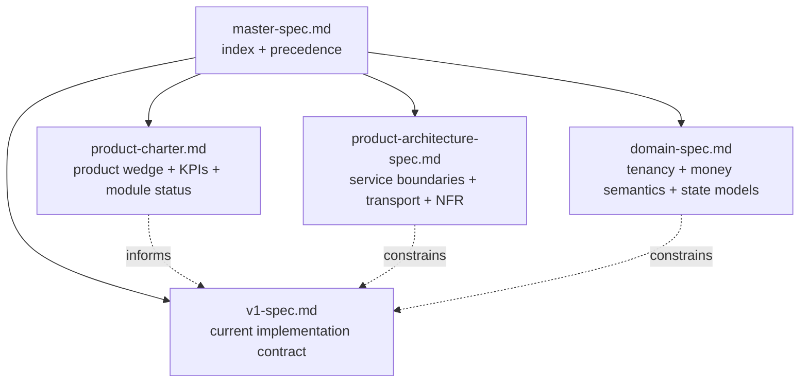

# Personal Finance OS Master Documentation

Version: 0.2.0  
Date: 2026-03-15  
Status: Top-level product contract and document index

## 1. Purpose

This file defines the documentation boundary for the full `Personal Finance OS` product.
It is intentionally short.
Strategic intent, architecture rules, domain rules, and version-specific delivery scope are split into separate documents so the team can distinguish:
- vision,
- implementation commitment,
- target-state architecture,
- exploratory backlog.

## 2. Document Map

| Document | Responsibility | Authority |
| --- | --- | --- |
| [product-charter.md](product-charter.md) | product wedge, personas, principles, measurable outcomes, roadmap themes, module status | strategic product authority |
| [product-architecture-spec.md](product-architecture-spec.md) | service boundaries, storage ownership, protocol rules, freshness, degraded modes, security boundaries, NFRs | architecture authority |
| [domain-spec.md](domain-spec.md) | tenancy, access and consent, canonical money rules, invariants, state machines, explainability contracts, retention | domain authority |
| [v1-spec.md](v1-spec.md) | current release scope and implementation contract | active build authority |

Planned later:
- `v2-spec.md`
- `v3-spec.md`

Until version-specific specs exist, V2 and V3 capabilities remain directionally planned or exploratory, not build commitments.

### 2.1 Documentation Stack Diagram

## 3. Status Language

Every capability and architectural choice must use one of these statuses:

- `Committed`: approved for implementation or treated as a normative contract now.
- `Planned`: approved direction, but not yet an implementation obligation.
- `Exploratory`: backlog or research idea; must not drive core design decisions yet.

If a section does not declare status, it is not authoritative.

## 4. Cross-Document Invariants

The following rules apply across all child specifications:

- `PFOS` is an operational personal finance product first, not a generic distributed-systems sandbox.
- Primary tenancy is `user-centric`; `household` is an explicit sharing and coordination layer, not the default owner of imported finance data.
- Canonical money truth lives in the ledger-oriented PostgreSQL domain and its approved planning tables, not in MongoDB, Redis, Telegram, or ClickHouse projections.
- User-facing decisions such as affordability, free capital, and investment readiness must not be computed solely from stale analytical projections.
- Telegram is a delegated delivery and command surface only after an authenticated PFOS user links it; it is never the source of identity truth.

## 5. Precedence Rules

When two documents appear to conflict, use this order:

1. `v1-spec.md` wins for the current implementation boundary.
2. `domain-spec.md` wins for tenancy, permissions, canonical money semantics, invariants, and lifecycle behavior.
3. `product-architecture-spec.md` wins for service ownership, storage boundaries, transport rules, freshness, and degraded-mode behavior.
4. `product-charter.md` wins for product wedge, module promotion rules, and KPI framing.

`master-spec.md` does not duplicate the child contracts. It only defines the stack and the precedence model.

## 6. Immediate Follow-Up Expectations

The current documentation stack is valid for:
- V1 implementation,
- V2 design preparation,
- review of future module proposals.

No module may move from `Planned` or `Exploratory` to `Committed` until the responsible version spec exists or the affected child specs are updated with:
- actor,
- trigger,
- decision rule,
- canonical inputs,
- state model,
- owner service,
- success metric.
