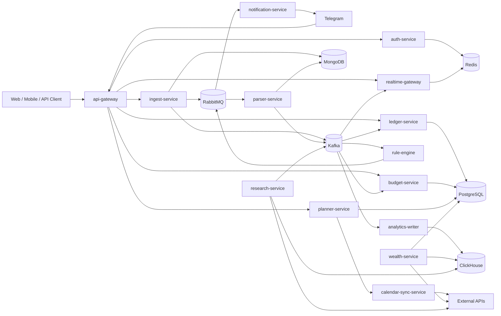

# Personal Finance OS Master Specification

Version: 0.1.0  
Date: 2026-03-15  
Status: Product and system master specification

## 1. Document Purpose

This document describes the full target state of `Personal Finance OS` across V1, V2, and V3.
It is the top-level specification for the entire project, including product vision, business value, user journeys, functional modules, system architecture, data model, integrations, non-functional requirements, delivery phases, and advanced backlog ideas.

This document is intentionally broader than the implementation-focused V1 scope. For current implementation boundaries, see [v1-spec.md](v1-spec.md).

## 2. Product Vision

`Personal Finance OS` is a personal financial operating system. It is not just a spending tracker and not just an analytics dashboard. Its target form is a system that:
- collects financial signals,
- explains them,
- forecasts consequences,
- organizes obligations,
- helps build discipline,
- supports money planning and later wealth management.

The long-term product should answer four questions continuously:
1. What happened with my money?
2. What is happening right now?
3. What is likely to happen next?
4. What should I do about it?

## 3. Product Positioning

### 3.1 Category
The product sits at the intersection of personal finance tracking, financial planning, operational reminders, behavioral analytics, and future wealth management.

### 3.2 What the Product Is Not
The product is not:
- a bookkeeping suite for small business accounting,
- an auto-trading bot,
- a broker-dealer,
- a copy-trading platform,
- a black-box AI investment adviser.

### 3.3 Product Promise
The product promise is financial clarity, operational control, better timing of decisions, reduced financial forgetfulness, better spending discipline, and better readiness for investing later.

## 4. Strategic Product Principles

1. `Operational before decorative`: the system must help a user act, not just observe charts.
2. `Explainability before magic`: every classification, alert, forecast, and recommendation should be explainable.
3. `Safety before aggressiveness`: the system should protect liquidity and essential obligations before enabling growth modules.
4. `Event-driven core`: every meaningful business action should become an event in the system.
5. `Idempotency by default`: imports, jobs, events, and notifications must tolerate retries and duplicates.
6. `One source of truth per concern`: PostgreSQL for core domain, MongoDB for raw imports, ClickHouse for analytical projections.
7. `Automation with boundaries`: the system should automate reminders, classification, and planning, but not take irreversible financial actions in V1.
8. `Progressive sophistication`: the product must be useful in V1 and become smarter in V2/V3 without breaking the core model.

## 5. Product Goals

### 5.1 Primary Goals
- give the user a unified record of money movement,
- detect recurring and unnecessary spending,
- help the user avoid missed obligations,
- provide budget and cashflow awareness,
- establish the data foundation for goals and investing,
- expose strong backend/highload architecture.

### 5.2 Secondary Goals
- support household mode,
- support real-time collaboration,
- support explainable financial assistant workflows,
- support later integrations with broker and calendar systems.

### 5.3 Engineering Goals
- showcase production-style microservice architecture,
- demonstrate practical use of Kafka, RabbitMQ, Redis, WebSocket, PostgreSQL, MongoDB, ClickHouse,
- implement observability, CI, tests, graceful shutdown, JWT/RBAC,
- demonstrate event contracts, replayability, projections, and asynchronous workflows.

## 6. Product Personas

### 6.1 Owner
A primary user managing personal finances and long-term goals.

### 6.2 Household Admin
A user coordinating shared expenses, obligations, and roles for a family or household.

### 6.3 Advisor / Read-Only Viewer
A trusted person reviewing financial patterns without editing primary data.

### 6.4 Power User
A user who wants automation, Telegram control plane, exports, rules, and scenario planning.

## 7. Core Product Pillars

### 7.1 Finance Visibility
- statement import,
- normalization,
- categories,
- merchant cleanup,
- cash in / cash out visibility,
- unified transaction history.

### 7.2 Obligation Control
- bills,
- subscriptions,
- recurring charges,
- reminders,
- due dates,
- escalation when ignored.

### 7.3 Planning
- budgets,
- spending limits,
- monthly and weekly plans,
- goals,
- forecast to payday / month-end,
- “can I afford this?” logic.

### 7.4 Realtime Awareness
- live import state,
- live alerts,
- dashboard updates,
- Telegram messages,
- daily and weekly digests.

### 7.5 Wealth Readiness
- emergency fund target,
- free capital detection,
- net worth view,
- later portfolio allocation and broker aggregation.

## 8. Full Product Module Map

### 8.1 Core Finance Ingestion Module
Purpose: bring financial data into the system reliably.

Inputs:
- CSV statements,
- OFX / QIF files,
- raw JSON payloads,
- later PDF / OCR outputs,
- later banking connectors.

Capabilities:
- file upload,
- content hashing,
- deduplication,
- status tracking,
- async parse orchestration,
- raw payload retention,
- recovery from partially completed imports.

### 8.2 Parsing and Normalization Module
Purpose: convert source-specific data into canonical transaction structures.

Capabilities:
- field normalization,
- currency handling,
- merchant normalization,
- category suggestion,
- parse summaries,
- parser versioning,
- idempotent projection storage.

Ideas:
- merchant alias dictionary,
- fuzzy matching,
- parser confidence score,
- manual review queue for uncertain lines,
- versioned parser outputs.

### 8.3 Ledger Module
Purpose: represent the authoritative business ledger of user finances.

Capabilities:
- accounts,
- transactions,
- categories,
- recurring detection,
- correction history,
- transaction querying,
- import-to-ledger traceability.

Ideas:
- account balances,
- monthly closing snapshots,
- transaction merge / split,
- duplicate detection,
- audit of manual edits,
- category override rules.

### 8.4 Budgeting Module
Purpose: turn transaction history into spending control.

Capabilities:
- monthly category limits,
- weekly budgets,
- soft and hard limits,
- burn rate tracking,
- category variance,
- budget carry-over policies.

Ideas:
- shared household budgets,
- category envelopes,
- dynamic limit recommendations,
- auto-tightening of discretionary categories.

### 8.5 Recurring Payments and Subscription Intelligence Module
Purpose: identify recurring obligations and wasteful subscriptions.

Capabilities:
- recurring pattern detection,
- expected next charge date,
- subscription list,
- rising subscription cost detection,
- inactive subscription suspicion.

Ideas:
- charge drift alerts,
- overlapping services,
- ownership by household member,
- one-click reminder schedules.

### 8.6 Rule Engine Module
Purpose: transform financial events into alerts and actions.

Capabilities:
- overspend detection,
- anomaly detection,
- recurring reminders,
- threshold rules,
- merchant watch rules,
- event-to-notification workflows.

Ideas:
- declarative rule DSL,
- simulation mode,
- rule audit trail,
- per-user severity policy,
- suppression windows,
- digest vs immediate delivery policies.

### 8.7 Notification and Delivery Module
Purpose: send actionable information to users.

Channels:
- Telegram,
- web dashboard,
- email,
- later voice calls,
- later mobile push.

Capabilities:
- retries,
- DLQ,
- delivery receipts,
- throttling,
- notification preferences,
- digest generation.

Ideas:
- smart escalation,
- quiet hours,
- high-priority only mode,
- bundled alerts,
- delivery analytics.

### 8.8 Realtime Dashboard Module
Purpose: provide live visibility of system state.

Capabilities:
- import progress,
- newly parsed transactions,
- live alerts,
- budget burn indicators,
- notification stream,
- active session state.

Ideas:
- per-widget subscriptions,
- typed event channels,
- presence-aware sync,
- optimistic client updates.

### 8.9 Analytics and Reporting Module
Purpose: turn domain events into analytical insight.

Capabilities:
- daily spend projections,
- category reports,
- merchant concentration,
- week-over-week and month-over-month deltas,
- alert volume analytics,
- recurring spend reports.

Ideas:
- heatmaps,
- weekday spending analytics,
- trend breakdowns,
- explainable variance reports,
- report caching and snapshots.

### 8.10 Goals and Savings Module
Purpose: help users accumulate toward defined targets.

Capabilities:
- financial goals,
- contribution pace,
- target date analysis,
- gap-to-goal visibility,
- allocation of surplus cash.

Ideas:
- emergency fund goal,
- vacation goal,
- device purchase goal,
- debt payoff goal,
- rule-driven transfers to goals.

### 8.11 Cashflow Forecast Module
Purpose: predict near-term financial pressure.

Capabilities:
- month-end forecast,
- pre-salary forecast,
- expected obligations,
- recurring income projection,
- risk of shortfall detection.

Ideas:
- scenario testing,
- confidence intervals,
- “what if I buy this?” flows,
- travel-adjusted cashflow.

### 8.12 Calendar and Obligation Scheduling Module
Purpose: connect financial obligations with time management.

Capabilities:
- due date scheduling,
- payment reminder events,
- recurring calendar sync,
- reminder windows.

Ideas:
- Google Calendar integration,
- obligation rescheduling,
- travel-aware reminder timing,
- finance-only calendar feed.

### 8.13 Telegram Control Plane Module
Purpose: make the product operational from a chat interface.

Capabilities:
- digests,
- budget lookups,
- reminders,
- goal creation,
- category correction,
- planning commands,
- report generation.

Example commands:
- `/report month`
- `/budget food 500`
- `/forecast`
- `/subscriptions`
- `/goal vacation 2000`
- `/remind rent every 25`

Ideas:
- Telegram mini app,
- approval workflows,
- action buttons in alerts,
- quick budget adjustments from chat.

### 8.14 Household / Family Module
Purpose: coordinate finances among multiple participants.

Capabilities:
- roles,
- account visibility restrictions,
- shared budgets,
- shared obligations,
- shared goals,
- per-member accountability.

### 8.15 Wealth and Investing Module
Purpose: extend from finance management into wealth management.

Capabilities:
- emergency fund target,
- free-capital detection,
- broker account aggregation,
- portfolio visibility,
- allocation drift,
- goal-based investing.

Ideas:
- net worth tracking,
- scenario simulator,
- DCA planning,
- portfolio health score,
- research digest,
- watchlist monitoring,
- risk guardrails.

Constraint:
- this module must prioritize planning, allocation, and risk awareness,
- it must not overpromise profit,
- it must not rely on opaque or impulsive signal-chasing.

### 8.16 Financial Assistant and Explainability Module
Purpose: explain data and recommend actions without hiding reasoning.

Capabilities:
- why-category explanations,
- why-alert explanations,
- why-forecast explanations,
- monthly narrative digests,
- action recommendation summaries.

Ideas:
- assistant audit trail,
- prompt-to-rule conversion,
- explainable anomaly narratives,
- “top 3 actions to improve this month.”

## 9. Ideal End-to-End Product Flows

### 9.1 Daily User Flow
1. User receives a morning digest.
2. User sees upcoming obligations for the next 7 days.
3. User sees budget burn state and any new anomalies.
4. User adjusts one limit or reminder through Telegram.
5. Dashboard updates in real time.

### 9.2 Monthly Finance Review Flow
1. User uploads new statements.
2. System parses and normalizes transactions.
3. Ledger updates categories and recurring patterns.
4. Analytics writer builds month-to-date projections.
5. Rule engine produces monthly overspend or subscription alerts.
6. User receives report and recommendations.

### 9.3 Goal Planning Flow
1. User creates a goal.
2. System calculates required contribution pace.
3. Forecast engine checks affordability.
4. User is shown surplus cash and impact on liquidity.
5. Future versions propose portfolio placement for long-term goals.

### 9.4 Investment Readiness Flow
1. System calculates emergency fund requirement.
2. System calculates actual liquid reserve.
3. System determines safe free capital.
4. User sees whether investing is appropriate.
5. Future versions map free capital into a target portfolio plan.

## 10. Product Roadmap by Versions

### 10.1 V1: Core Financial Operations
Primary outcome: reliable ingestion, parsing, ledger persistence, recurring detection, rule-based alerts, Telegram delivery, analytical projections, realtime updates.

Modules in V1:
- auth,
- import,
- parser,
- ledger,
- basic recurring,
- basic budgets,
- basic rule engine,
- Telegram outbound notifications,
- realtime dashboard foundation,
- analytics foundation.

### 10.2 V2: Financial Planning and Operational Automation
Primary outcome: the system becomes a real planning tool.

Modules in V2:
- improved budgeting,
- goals,
- cashflow forecast,
- Google Calendar integration,
- Telegram control plane,
- digests,
- richer anomaly detection,
- explainability layer,
- household roles and shared workflows.

### 10.3 V3: Wealth Management and Advanced Intelligence
Primary outcome: the system expands from spending control to capital allocation.

Modules in V3:
- broker aggregation,
- emergency fund planner,
- free capital detector,
- net worth engine,
- portfolio builder,
- DCA planner,
- research digest,
- scenario simulator,
- portfolio health score.

## 11. Full Functional Scope

### 11.1 Authentication and Identity
Requirements:
- login,
- refresh,
- logout / revoke,
- JWT claims,
- RBAC,
- audit logging,
- device/session list,
- future MFA support.

### 11.2 Import and File Management
Requirements:
- upload raw file,
- validate size and type,
- compute fingerprint,
- deduplicate,
- persist metadata,
- expose status.

Potential additions:
- resumable uploads,
- source templates,
- import history filters,
- manual reparse,
- parser version pinning.

### 11.3 Parsing and Normalization
Requirements:
- parse source rows,
- normalize fields,
- identify amount sign,
- assign merchant and category,
- save projection,
- emit parsed event.

Potential additions:
- multiple parser strategies,
- confidence scoring,
- user corrections feeding future rules,
- locale-aware numeric formats.

### 11.4 Ledger and Categories
Requirements:
- store transactions,
- expose query API,
- support corrections,
- support category lists,
- support recurring detection.

Potential additions:
- transfer detection,
- internal account moves,
- account reconciliation,
- partial category split.

### 11.5 Budgets and Limits
Requirements:
- create category limit,
- compute spend versus budget,
- emit alerts at thresholds,
- show current burn state.

Potential additions:
- rolling budgets,
- carry-over,
- budget templates,
- dynamic category suggestion.

### 11.6 Rules and Alerts
Requirements:
- evaluate transaction events,
- publish notification jobs,
- store rule hits,
- support severity levels,
- avoid alert duplication.

Potential additions:
- event suppression,
- maintenance windows,
- rule prioritization,
- simulation mode.

### 11.7 Notifications
Requirements:
- send Telegram alerts,
- retry on failure,
- move failed jobs to DLQ,
- log delivery result.

Potential additions:
- digest batching,
- email/push,
- preferred-channel policy,
- escalation chain.

### 11.8 Realtime UX
Requirements:
- websocket auth,
- connection registration,
- per-user fan-out,
- live import state,
- live alerts,
- live dashboard refresh events.

Potential additions:
- channel subscription model,
- per-widget streams,
- heartbeats,
- replay since event id.

### 11.9 Reporting
Requirements:
- daily aggregates,
- category aggregates,
- recurring spend summary,
- alert volume summary.

Potential additions:
- net worth report,
- goal progress report,
- month narrative,
- tax-oriented tagging.

### 11.10 Planning and Goals
Requirements:
- define goal target amount,
- define target date,
- compute required monthly contribution,
- integrate with surplus cash model.

Potential additions:
- goal priority stack,
- multiple contribution strategies,
- goal conflicts.

### 11.11 Forecasting
Requirements:
- expected obligations,
- estimated income timing,
- pre-payday survivability,
- month-end balance projection.

Potential additions:
- probabilistic forecast,
- uncertainty band,
- event sensitivity analysis.

### 11.12 Calendar Integration
Requirements:
- create due date events,
- update or remove reminders,
- sync payment schedule.

Potential additions:
- travel-aware schedule shifts,
- recurring rent / debt sync,
- finance agenda view.

### 11.13 Wealth Layer
Requirements for later versions:
- emergency fund target,
- liquid reserve check,
- free capital calculation,
- portfolio view,
- broker sync.

Potential additions:
- allocation recommendations,
- scenario simulator,
- capital bucket engine,
- research digest.

### 11.14 AI and Explainability Layer
Requirements for later versions:
- explain categorizations,
- explain alert triggers,
- explain forecast assumptions,
- summarize actions.

Potential additions:
- conversational assistant,
- monthly coaching notes,
- anomaly explanation chain.

## 12. Architecture Overview

The full project uses a distributed service architecture where each service has a clear responsibility and data boundary.

Core stack:
- `Go`
- `PostgreSQL`
- `Redis`
- `MongoDB`
- `RabbitMQ`
- `Kafka`
- `ClickHouse`
- `REST`
- `gRPC`
- `WebSocket`
- `Docker Compose`
- `Prometheus`
- `Grafana`
- `GitHub Actions`

## 13. Service Catalog

| Service | Purpose | External Interface | Internal Interface | Primary State |
| --- | --- | --- | --- | --- |
| `api-gateway` | public entrypoint, auth middleware, route fan-out | REST, WebSocket | gRPC / HTTP | stateless |
| `auth-service` | authentication and session lifecycle | REST | gRPC later | Redis |
| `ingest-service` | import acceptance and raw persistence | REST | Kafka, RabbitMQ | MongoDB |
| `parser-service` | parse workers and normalization | internal workers, REST read endpoint | Kafka, RabbitMQ | MongoDB |
| `ledger-service` | transaction system of record | REST | Kafka consumer, gRPC later | PostgreSQL |
| `budget-service` | budgets, limits, envelopes | REST/gRPC | Kafka consume/publish | PostgreSQL |
| `rule-engine` | event-driven evaluation and alert production | internal | Kafka, RabbitMQ | PostgreSQL / Redis |
| `notification-service` | channel delivery and delivery state | internal | RabbitMQ | PostgreSQL / Redis |
| `analytics-writer` | event projection into analytical tables | internal | Kafka | ClickHouse |
| `realtime-gateway` | websocket fan-out and presence | WebSocket | Redis, Kafka later | Redis |
| `planner-service` | goals, planning, obligations, calendar sync orchestration | REST/gRPC | Kafka later | PostgreSQL |
| `calendar-sync-service` | external calendar adapter | internal / webhook | external REST | PostgreSQL |
| `telegram-adapter` | Telegram inbound/outbound adapter | webhook | gRPC / RabbitMQ | PostgreSQL / Redis |
| `wealth-service` | emergency fund, free capital, net worth, portfolio layer | REST/gRPC | Kafka, external APIs | PostgreSQL / ClickHouse |
| `research-service` | price/news/filings ingestion | internal | Kafka | ClickHouse / PostgreSQL |

## 14. High-Level Architecture Diagram



## 15. Protocol Use

### 15.1 REST
Use for public APIs, uploads, dashboard queries, and external integrations where REST is natural.

### 15.2 gRPC
Use for internal synchronous service calls and high-volume structured contracts.
Likely pairs:
- `api-gateway -> auth-service`
- `api-gateway -> ledger-service`
- `api-gateway -> planner-service`
- `planner-service -> calendar-sync-service`

### 15.3 Kafka
Use for domain events, audit trail, fan-out to analytics / rules / realtime, and eventual-consistency workflows.

### 15.4 RabbitMQ
Use for jobs, retries, delayed reminders, delivery queues, and DLQ patterns.

### 15.5 WebSocket
Use for live dashboard updates, alert stream, import progress, and user presence state.

## 16. Domain Model Overview

### 16.1 Core Domain Aggregates
Primary aggregates:
- User
- Session
- Household
- Account
- StatementImport
- ParsedImport
- Transaction
- Category
- RecurringPattern
- Budget
- BudgetLimit
- Rule
- RuleHit
- Notification
- DeliveryAttempt
- Goal
- ForecastSnapshot
- CalendarEventBinding
- PortfolioAccount
- Holding
- AllocationPolicy

### 16.2 Suggested PostgreSQL Tables
Identity and access:
- `users`
- `roles`
- `user_roles`
- `refresh_sessions`
- `households`
- `household_members`

Core finance:
- `accounts`
- `transactions`
- `categories`
- `transaction_overrides`
- `recurring_patterns`
- `merchant_aliases`

Planning:
- `budgets`
- `budget_limits`
- `goals`
- `goal_contributions`
- `forecast_snapshots`
- `obligations`

Automation:
- `rules`
- `rule_hits`
- `notifications`
- `notification_deliveries`
- `digests`

Future wealth:
- `portfolio_accounts`
- `holdings`
- `allocation_targets`
- `watchlists`
- `research_events`

### 16.3 Suggested MongoDB Collections
- `raw_imports`
- `parsed_imports`
- `ocr_documents`
- `connector_payloads`
- `import_recovery_log`

### 16.4 Suggested ClickHouse Projections
- `transactions_daily`
- `transactions_monthly`
- `spend_by_category_daily`
- `merchant_spend_daily`
- `recurring_charges_daily`
- `alerts_daily`
- `notification_delivery_daily`
- `forecast_accuracy_daily`
- `portfolio_snapshots_daily`
## 17. Event Model

### 17.1 Event Principles
- each event must be immutable,
- each event must have `event_id`, `event_type`, `occurred_at`, `source_service`, `version`,
- events must be idempotent at consumer level,
- all consumers must tolerate redelivery.

### 17.2 Core Event Families
Import events:
- `statement.uploaded`
- `statement.queued`
- `statement.parsed`
- `statement.failed`

Ledger events:
- `transaction.upserted`
- `transaction.categorized`
- `recurring.detected`

Planning events:
- `budget.created`
- `budget.updated`
- `budget.threshold_reached`
- `goal.created`
- `forecast.updated`

Alert events:
- `alert.created`
- `alert.acknowledged`
- `notification.requested`
- `notification.delivered`
- `notification.failed`

Calendar / scheduling events:
- `obligation.created`
- `obligation.reminder_due`
- `calendar.sync_requested`
- `calendar.synced`

Wealth events:
- `portfolio.synced`
- `allocation.drift_detected`
- `free_capital.updated`
- `research.signal_ingested`

### 17.3 Suggested Kafka Topics
Core V1:
- `statement.uploaded`
- `statement.parsed`
- `transaction.upserted`
- `alert.created`

Planned later:
- `budget.updated`
- `goal.updated`
- `forecast.updated`
- `notification.lifecycle`
- `portfolio.updated`
- `research.events`

### 17.4 Suggested RabbitMQ Queues
Core V1:
- `parse.statement`
- `send.telegram`
- `send.telegram.dlq`

Planned later:
- `build.digest`
- `sync.calendar`
- `recompute.forecast`
- `evaluate.goal`
- `send.email`
- `send.push`
- `voice.call`

## 18. Full API Surface

### 18.1 Public API Groups
Auth:
- `/auth/login`
- `/auth/refresh`
- `/auth/logout`
- `/auth/me`
- `/auth/sessions`

Imports:
- `/imports/raw`
- `/imports/{import_id}`
- `/imports`
- `/imports/{import_id}/reparse`

Parser:
- `/parser/results/{import_id}`
- `/parser/results/{import_id}/review`

Ledger:
- `/api/v1/transactions`
- `/api/v1/transactions/{id}`
- `/api/v1/categories`
- `/api/v1/recurring`
- `/api/v1/accounts`

Budgets:
- `/api/v1/budgets`
- `/api/v1/budgets/{id}`
- `/api/v1/budget-limits`
- `/api/v1/budget-status`

Goals:
- `/api/v1/goals`
- `/api/v1/goals/{id}`
- `/api/v1/goals/{id}/forecast`

Forecast:
- `/api/v1/forecast`
- `/api/v1/forecast/scenario`

Notifications:
- `/api/v1/notifications`
- `/api/v1/notifications/preferences`

Realtime:
- `/ws`

Future wealth:
- `/api/v1/net-worth`
- `/api/v1/emergency-fund`
- `/api/v1/free-capital`
- `/api/v1/portfolio`
- `/api/v1/watchlist`

### 18.2 gRPC Surface
Auth service:
- `ValidateAccessToken`
- `ResolveSubject`
- `RevokeSession`

Ledger service:
- `UpsertTransactions`
- `ListTransactions`
- `DetectRecurring`

Budget service:
- `EvaluateBudgetState`
- `GetBudgetSnapshot`

Planner service:
- `CreateGoal`
- `ComputeForecast`
- `CreateObligation`

Realtime service:
- `BroadcastUserEvent`
- `BroadcastDashboardEvent`

## 19. Realtime Event Types

Suggested WebSocket event families:
- `import.status.changed`
- `ledger.transaction.created`
- `budget.status.changed`
- `alert.created`
- `notification.delivery.changed`
- `forecast.updated`
- `goal.updated`
- `portfolio.updated`

Event envelope:

```json
{
  "type": "alert.created",
  "user_id": "user-demo",
  "occurred_at": "2026-03-15T12:00:00Z",
  "payload": {
    "severity": "warning",
    "message": "Food spending exceeded 80 percent of monthly limit"
  }
}
```

## 20. Business Rules and Heuristics

### 20.1 Recurring Detection Heuristics
- same merchant,
- same amount or close amount tolerance,
- repeating interval within expected windows,
- minimum count threshold,
- category consistency.

### 20.2 Budget Heuristics
- actual spend / budget ratio,
- pace versus day-of-month,
- essential vs discretionary weighting,
- household split awareness in later versions.

### 20.3 Anomaly Heuristics
- merchant novelty,
- extreme amount,
- category spike,
- unusual time window,
- duplicate pattern suspicion.

### 20.4 Forecast Heuristics
- known recurring obligations,
- recent income timing,
- historical spend pace,
- current available cash,
- planned purchases and goals.

### 20.5 Emergency Fund Heuristics
- essential monthly spend baseline,
- target months multiplier,
- current liquidity coverage,
- deficit to target.

### 20.6 Free Capital Heuristics
- available cash,
- upcoming obligations,
- emergency fund gap,
- debt pressure,
- user-defined reserve floor.

## 21. Security Model

Authentication:
- JWT access tokens,
- refresh tokens with server-side revocation,
- service-to-service credentials.

Authorization:
- RBAC by role,
- later household- and account-level scoping,
- action audit trail.

Data protection:
- sensitive raw imports,
- encryption at rest where possible,
- secrets via environment / secret store,
- scrub tokens and credentials from logs.

Future enhancements:
- MFA,
- field-level encryption,
- consent model for shared access,
- suspicious-login alerting.

## 22. Observability Model

Logging:
- structured logs,
- request correlation,
- import / event / queue context.

Metrics:
- HTTP latency,
- queue depth,
- consumer lag,
- parse duration,
- alert rates,
- notification retries,
- websocket connections,
- forecast accuracy,
- projection freshness.

Tracing:
- later distributed tracing across HTTP, Kafka, RabbitMQ, and DB calls.

Dashboards:
- system health,
- import pipeline,
- parser reliability,
- ledger throughput,
- rule engine hits,
- notification delivery,
- websocket fan-out,
- analytics freshness.

## 23. Non-Functional Requirements

Scalability:
- horizontal scale for stateless services,
- partitioned Kafka topics,
- multiple Rabbit consumers,
- ClickHouse for high-volume analytical queries.

Reliability:
- graceful shutdown,
- retry policies,
- DLQ,
- idempotent consumers,
- health checks,
- readiness gates.

Performance:
- import acknowledgement should be near-immediate,
- parse latency should be bounded by queue and parser throughput,
- dashboard queries should use analytical projections where appropriate.

Maintainability:
- documented event contracts,
- OpenAPI and protobuf contracts,
- modular internal packages,
- explicit ownership per service.

Auditability:
- import lineage,
- category override history,
- rule hit history,
- notification delivery history,
- future assistant explanation history.

## 24. Testing Strategy for Full Project

Unit tests:
- parser,
- recurring logic,
- rule heuristics,
- auth session rotation,
- forecast math,
- budget math,
- goal math.

Integration tests:
- HTTP endpoints,
- Redis sessions,
- Mongo imports,
- Rabbit jobs,
- Kafka topics,
- PostgreSQL persistence,
- ClickHouse projections,
- WebSocket delivery.

Contract tests:
- OpenAPI compatibility,
- gRPC schema validation,
- event payload validation.

Scenario tests:
- monthly overspend case,
- subscription detection case,
- missed obligation case,
- goal affordability case,
- later free-capital and investment-readiness case.

## 25. Deployment Model

Local:
- Docker Compose.

Staging:
- containerized services with ephemeral infrastructure or shared managed instances.

Production later:
- Kubernetes or Nomad,
- managed Kafka / PostgreSQL / Redis / ClickHouse where appropriate,
- separate telemetry stack,
- secret manager.

## 26. CI / CD Expectations

GitHub Actions should cover:
- formatting and linting,
- unit tests,
- integration tests,
- contract validation,
- Docker build,
- security scan,
- artifact publishing,
- staged deploy workflow later.

## 27. Delivery Roadmap

### 27.1 Stage 1: V1 Foundation
- auth-service hardening,
- api-gateway routing,
- ingest-service and parser-service stabilization,
- PostgreSQL ledger implementation,
- initial OpenAPI completion.

### 27.2 Stage 2: V1 Completion
- transaction event pipeline,
- rule-engine,
- notification-service,
- ClickHouse projections,
- realtime gateway,
- integration tests.

### 27.3 Stage 3: V2 Planning Layer
- budgets and budget alerts,
- goals,
- cashflow forecast,
- Telegram control plane,
- Google Calendar sync,
- digests.

### 27.4 Stage 4: V2 Operational Maturity
- household mode,
- advanced analytics,
- explainability layer,
- richer anomaly detection,
- planning UX improvements.

### 27.5 Stage 5: V3 Wealth Layer
- emergency fund planner,
- free capital engine,
- net worth,
- broker aggregation,
- portfolio visibility,
- research digest.

### 27.6 Stage 6: V3 Intelligence Layer
- scenario simulator,
- portfolio health score,
- explainable wealth assistant,
- later advanced recommendation systems with strong safety boundaries.

## 28. Risks and Constraints

Product risks:
- overexpanding scope too early,
- trying to solve investing before finance basics,
- building a dashboard-heavy product with weak operational value,
- creating opaque recommendations without explainability.

Engineering risks:
- duplicated logic across services,
- unversioned event contracts,
- unreliable retries without idempotency,
- stale projections,
- weak migration discipline.

Governance and safety risks:
- sensitive financial data handling,
- overstepping into regulated investment-advice behavior,
- weak auditability for recommendations and rule outputs.

## 29. Success Criteria for the Full Project

Product success:
- users can understand, plan, and act on their finances from one system,
- missed obligations decrease,
- recurring waste becomes visible,
- month-end surprises decrease,
- goals and reserve planning become operational.

Engineering success:
- event-driven pipeline is reliable,
- services are observable and testable,
- contracts are documented,
- main workflows survive retries and restarts,
- the architecture visibly demonstrates backend and systems design skill.

## 30. Future Idea Backlog

High-value future ideas:
- net worth dashboard,
- debt payoff optimizer,
- paycheck allocation planner,
- travel budget planner,
- tax and annual obligation tracker,
- finance assistant weekly coaching,
- personalized digest tone modes,
- assistant-proposed rule creation,
- shared family obligations board,
- portfolio readiness checklist,
- watchlist and earnings calendar,
- statement parser marketplace by source format,
- anomaly explanation timeline,
- export to accounting / spreadsheet tools,
- custom webhook integrations.

## 31. Relationship to V1 Spec

`master-spec.md` defines the full intended project shape.
`v1-spec.md` remains the authoritative implementation contract for the current delivery stage.
When there is a conflict between aspirational scope and current implementation scope, `v1-spec.md` wins for active development.


