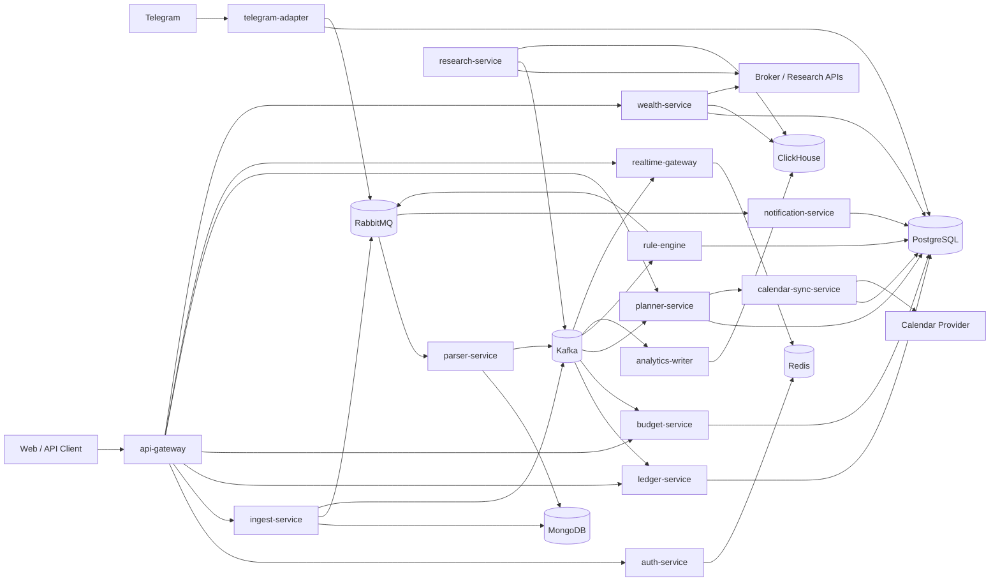
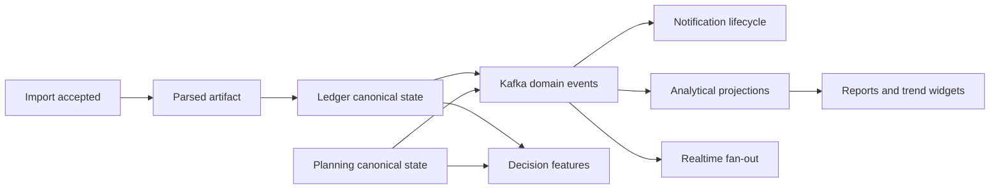

# Personal Finance OS Product Architecture Specification

Version: 0.2.0  
Date: 2026-03-15  
Status: Architecture authority

## 1. Purpose

This document defines service ownership, source-of-truth boundaries, transport rules, freshness semantics, degraded modes, security boundaries, and quantitative non-functional targets for the full product.

## 2. Architecture Posture

`PFOS` uses a modular distributed architecture because the project explicitly values strong backend/system-design quality.
That is allowed.
It is not permission to let multiple services compute different versions of the same financial truth.

The architecture rule is:

`one canonical owner per business concern, many consumers, zero duplicated money semantics`

### 2.1 High-Level System Context

### 2.2 Canonical Write and Derived Read Flow

## 3. Service Ownership Matrix

| Service | Owns writes for | Canonical state | Build status |
| --- | --- | --- | --- |
| `auth-service` | identity catalog resolution, access claims, linked devices, active sessions | durable identity store or seeded config plus Redis active sessions | `Committed` V1 |
| `ingest-service` | import acceptance, raw import metadata, dedup decision | MongoDB `raw_imports` | `Committed` V1 |
| `parser-service` | parsed import artifacts, parse summaries, parser version outputs | MongoDB `parsed_imports` | `Committed` V1 |
| `ledger-service` | accounts, transactions, transaction corrections, balance baselines, confirmed transfer links | PostgreSQL | `Committed` V1 |
| `budget-service` | budgets, limits, budget evaluation records | PostgreSQL | `Committed` semantics, dedicated service extraction `Planned` V1/V2 |
| `planner-service` | obligations, goals, planned expenses, forecast inputs and snapshots | PostgreSQL | `Planned` V2 |
| `rule-engine` | rule definitions, suppression configs, evaluation traces, alert intents | PostgreSQL | `Committed` V1 foundation |
| `notification-service` | notification lifecycle, delivery attempts, channel preference application | PostgreSQL | `Committed` V1 foundation |
| `analytics-writer` | analytical projections only | ClickHouse | `Committed` V1 foundation |
| `realtime-gateway` | live connections, subscriptions, fan-out state | Redis | `Committed` V1 foundation |
| `telegram-adapter` | Telegram link bindings, inbound command sessions, Telegram-specific delivery metadata | PostgreSQL | `Planned` V2 |
| `calendar-sync-service` | external calendar bindings and sync job state | PostgreSQL | `Planned` V2 |
| `wealth-service` | reserve rules, portfolio accounts, holdings, valuation snapshots, free-capital assessments | PostgreSQL plus ClickHouse for history | `Planned` V3 |
| `research-service` | research feed metadata, ingestion history, normalized research events | PostgreSQL plus ClickHouse for time series | `Exploratory` V3 |

## 4. Source of Truth by Concern

| Concern | Canonical owner | Store | Notes |
| --- | --- | --- | --- |
| User identity catalog and linked devices | `auth-service` | durable config or PostgreSQL | Redis is not canonical for identities |
| Active refresh sessions | `auth-service` | Redis | active-session state only |
| Raw import payload and metadata | `ingest-service` | MongoDB | raw payload is sensitive and not a planning source |
| Parsed import artifact | `parser-service` | MongoDB | intermediate artifact only |
| Transactions and categories | `ledger-service` | PostgreSQL | canonical money movement |
| Account balances and balance confidence | `ledger-service` | PostgreSQL | required for planning confidence |
| Detected recurring patterns | `ledger-service` in V1 | PostgreSQL derived tables | inferred artifacts only, not canonical money truth |
| Budgets and limit thresholds | `budget-service` | PostgreSQL | may read ledger, must not redefine transaction truth |
| Goals, obligations, planned expenses, forecast snapshots | `planner-service` | PostgreSQL | planning state |
| Rule definitions, suppression state, evaluation traces | `rule-engine` | PostgreSQL | rules are domain resources, not just code paths |
| Notification lifecycle | `notification-service` | PostgreSQL | RabbitMQ is transport, not state |
| Telegram binding | `telegram-adapter` | PostgreSQL | Telegram user id is integration metadata, not identity truth |
| Calendar binding and sync history | `calendar-sync-service` | PostgreSQL | external calendar is a replica target |
| Analytical dashboards and trends | `analytics-writer` | ClickHouse | derived, never canonical |
| Wealth history charts | `wealth-service` | ClickHouse | derived visualization layer |
| Research/news feed events | `research-service` | PostgreSQL plus ClickHouse | exploratory and separately governed |

### 4.1 Transitional Ownership in V1

Some V1 features are committed before every target service is extracted.

Rules:
- V1 budget semantics are committed, but configuration and evaluation may remain co-located with ledger or rule-engine flows until `budget-service` is extracted,
- recurring detection may execute inside `ledger-service` in V1, but detected patterns remain inferred artifacts and must not mutate canonical transaction truth,
- shared-access and planner-owned obligation semantics must not be implied before their owner service exists.

## 5. Transport Decision Rules

### 5.1 REST

Use `REST` for:
- public APIs,
- upload flows,
- dashboard reads,
- admin endpoints,
- external integrations where request and response are natural.

### 5.2 gRPC

Use `gRPC` only for internal synchronous calls when the caller needs an immediate answer to continue the user request or a bounded internal workflow.

Examples:
- `api-gateway -> auth-service` token validation
- `api-gateway -> ledger-service` low-latency query or command
- `planner-service -> calendar-sync-service` read or validation calls only

Do not use `gRPC` for side effects that can be modelled as queued work.

### 5.3 Kafka

Use `Kafka` for domain facts after canonical state has been committed.

Rules:
- canonical DB write happens first,
- cross-service domain publication uses an outbox pattern when the service owns durable state,
- consumers must be idempotent,
- events are immutable and versioned.

### 5.3.1 Event Versioning Strategy

Every published event must contain:
- `envelope_version`
- `event_type`
- `payload_version`

Rules:
- additive payload evolution is allowed within a payload version,
- breaking changes require a new `payload_version` and, if routing semantics change, a new `event_type`,
- consumers must ignore unknown additive fields,
- replay tooling must be able to identify the evaluator or producer version that emitted the event.

### 5.4 RabbitMQ

Use `RabbitMQ` for:
- retryable jobs,
- delayed reminders,
- channel delivery work,
- DLQ-based operational recovery,
- external side-effect execution.

Rules:
- job queues are not a source of truth,
- job payloads reference canonical identifiers,
- retry policy and terminal failure state must be visible in the owner service.

### 5.5 WebSocket

Use `WebSocket` only for fan-out of already committed or already published state.
WebSocket messages must never become the only record of a user-visible change.

### 5.6 Realtime Replay and Resync

Realtime streams must support:
- `last_event_id` or cursor-based resume on reconnect,
- permission revalidation on connect and reconnect,
- periodic session revalidation for long-lived sockets,
- `resync_required` fallback when replay is incomplete or scope changed.

Rules:
- if a grant is revoked, future fan-out for that scope must stop without waiting for a full client refresh,
- if replay cannot guarantee consistency, the client must perform full panel resync,
- Telegram-initiated state changes must be observable through the same canonical event stream used by dashboard clients.

## 6. Mandatory Cross-Service Flow Rules

| Flow | Required rule |
| --- | --- |
| `planner-service -> calendar-sync-service` | planner commits obligation state, emits `calendar.sync_requested`, calendar service executes async sync and records binding state |
| `rule-engine -> notification-service` | rule engine emits `alert.created` or `notification.requested`, notification service creates lifecycle record, RabbitMQ carries per-channel delivery jobs |
| `realtime-gateway` updates | realtime fan-out comes from Kafka events or canonical owner callbacks, never directly from speculative UI state |
| `wealth-service` calculations | reserve and free-capital decisions use canonical ledger and planner data; ClickHouse is chart support only |

## 7. Projection and Freshness Policy

Every derived payload that is not canonical must include:
- `computed_at`
- `stale_after`
- `freshness_status`
- `data_completeness`
- `based_on_range`

Allowed `freshness_status` values:
- `fresh`
- `stale`
- `degraded`
- `unavailable`

### 7.1 What May Use Projections

| Product output | Allowed source |
| --- | --- |
| Transaction list, balances, obligations due now | canonical PostgreSQL only |
| Budget threshold evaluation | canonical transaction and budget data only |
| Forecast, affordability, free capital | canonical planning and ledger data only |
| Dashboard trend cards and historical reports | ClickHouse allowed with freshness indicators |
| Wealth history charts | ClickHouse allowed |
| Wealth readiness decisions | canonical data plus fresh market data only |

If freshness is not sufficient for a decision-oriented feature, the feature must return `insufficient_data` or `stale_data`, not a confident answer.

## 8. Degraded Modes

| Dependency failure | Acceptable degraded behavior | User-visible result |
| --- | --- | --- |
| `Kafka` unavailable | accept raw import only if canonical owner can persist a recoverable pending state; mark event publication pending | import visible, downstream updates delayed |
| `RabbitMQ` unavailable | reject or defer job-producing operations that cannot complete safely | alert delivery or parse queueing unavailable with explicit status |
| `ClickHouse` unavailable | serve canonical pages, suppress analytics cards or mark stale | dashboard analytics unavailable, ledger still usable |
| Telegram API rate-limited or failing | retain notification record, retry within channel policy, escalate to secondary channel later if configured | alert shown as delayed or failed delivery |
| Calendar OAuth expired | keep obligation truth in planner, stop external sync, surface reconnect requirement | obligations still tracked, external calendar stale |
| Broker or research feed degraded | stop freshness-sensitive wealth outputs | wealth charts or research marked unavailable |

### 8.1 Derived Data Deletion Propagation

Canonical delete or revoke workflows must propagate to derived systems.

Rules:
- ClickHouse projections must be purged or rebuilt to remove deleted user data,
- forecast snapshots and cached planning artifacts derived from deleted data must be invalidated,
- notification history must be deleted or anonymized according to retention policy,
- websocket presence and subscription state must be removed immediately,
- retained event streams must either expire by bounded retention or carry anonymized identifiers consistent with deletion policy.

## 9. Security Boundaries

### 9.1 User and Service Authentication

- user access uses JWT plus refresh-session validation,
- internal service calls use scoped service credentials,
- per-service scopes are mandatory for cross-service commands,
- `mTLS` is a production-later enhancement, not assumed in local V1.

### 9.2 External Webhooks and Adapters

Inbound integrations must support:
- signature or token validation,
- request timestamp validation where supported,
- replay protection,
- explicit binding lookup before any state-changing action.

### 9.3 Telegram Boundary

- Telegram accounts are linked only from an authenticated PFOS session by challenge flow,
- Telegram never creates or resolves PFOS identity by itself,
- Telegram commands execute within the same resource scopes the user already has,
- revoke of Telegram access must disable future commands immediately and remove delivery routing.

### 9.4 Research Safety Boundary

Research or market data must never influence decision-oriented financial outputs unless:
- the mapping to user-facing recommendation is explainable,
- source freshness and provenance are visible,
- the feature is explicitly enabled within the product stage that allows it.

## 10. Quantitative Non-Functional Targets

| Area | Target |
| --- | --- |
| Login or token validation | `p95 <= 500 ms` |
| Import acknowledgement | `p50 <= 300 ms`, `p95 <= 1 s`, hard timeout for accepted request `<= 5 s` |
| Import status visibility after acceptance | visible to client `<= 2 s` |
| Parse completion for CSV files up to `5 MB` | `p95 <= 30 s` |
| Notification job creation after alert | `p95 <= 2 s` from `alert.created` |
| Permission or grant revoke propagation to live channels | `p95 <= 30 s` |
| WebSocket fan-out after source event | `p95 <= 2 s` |
| ClickHouse dashboard freshness | `p95 <= 60 s` behind canonical event stream |
| Forecast recompute after relevant input change | `p95 <= 30 s` for active user scope |
| Idempotency conflict resolution visibility | duplicate or replay conflict reflected in owner state `<= 10 s` |
| DLQ triage start | operator-visible within `<= 5 min` of terminal failure |
| Recovery objective for Kafka, RabbitMQ, or ClickHouse outage | critical path resumed within defined runbook target `<= 60 min` |
| Duplicate alert ceiling | no more than `1` user-visible duplicate per dedup key within active window |

If the system cannot meet a target, the API or UI must expose degraded status rather than silently acting fresh.
