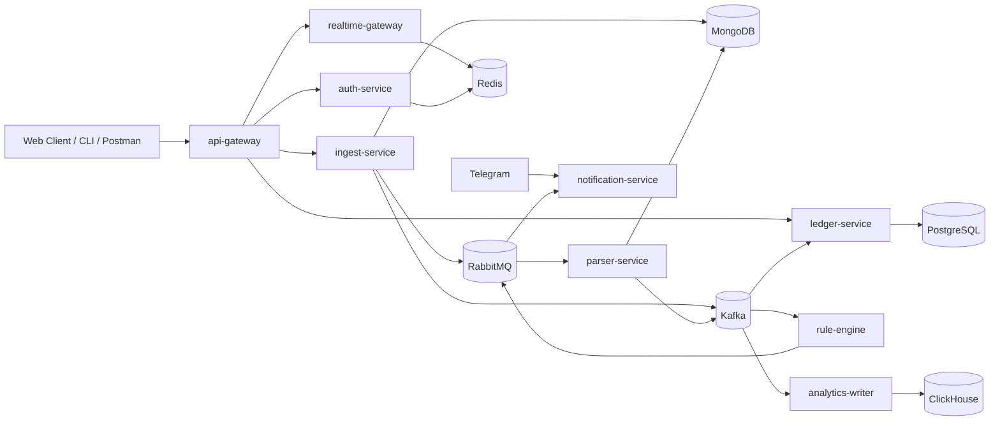
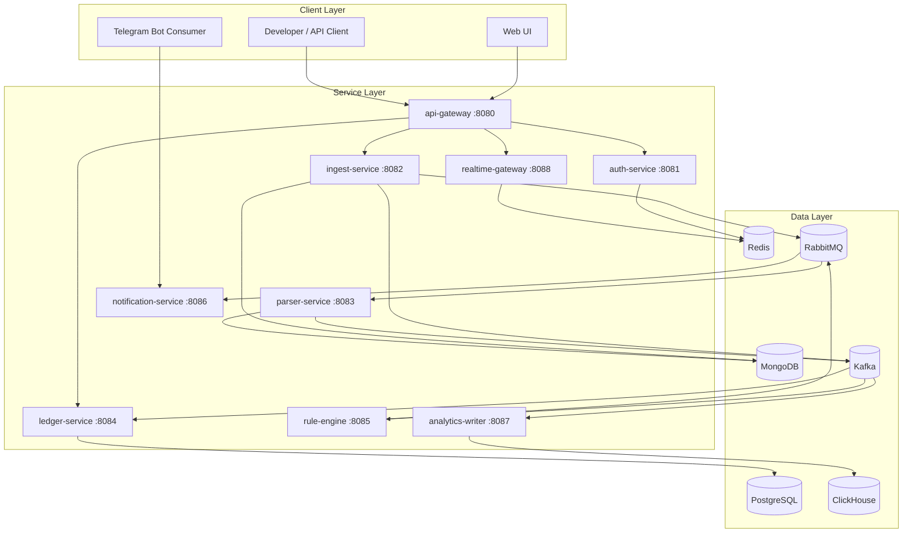
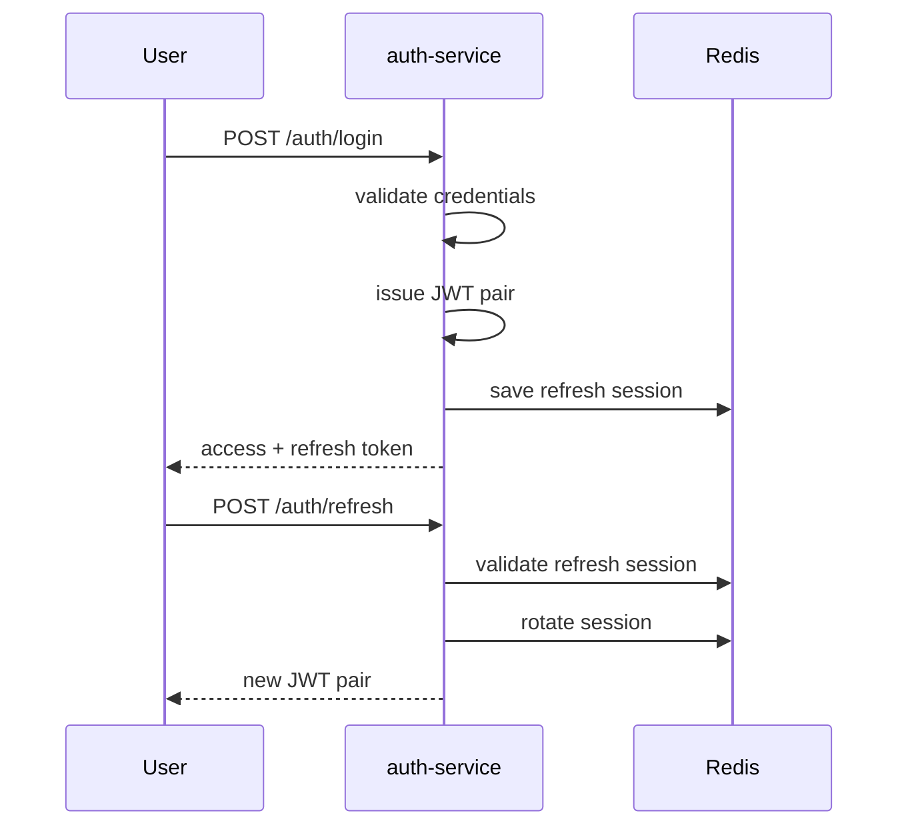
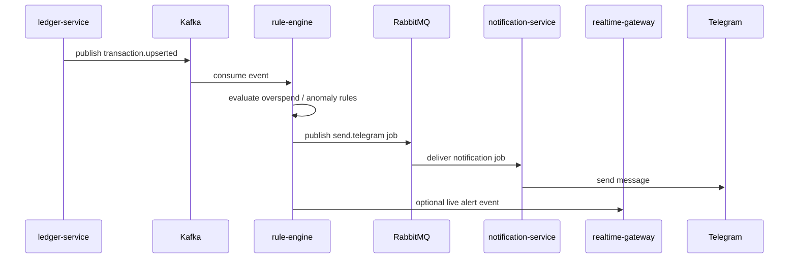

# Personal Finance OS V1 Specification

Version: 0.1.0  
Date: 2026-03-15  
Status: Draft / baseline for implementation

## 1. Purpose

This document defines the V1 scope of `Personal Finance OS`.
The goal of V1 is to deliver a real, usable backend platform that:
- imports financial statements,
- normalizes transactions,
- stores them in a ledger,
- detects recurring spend and basic overspend/anomaly conditions,
- emits notifications,
- updates clients in real time,
- produces analytical projections.

V1 is intentionally focused on the core financial operations layer.
It does not include advanced investment, broker aggregation, Google Calendar sync, or Telegram command workflows beyond basic outbound notifications.

## 2. Product Goal

`Personal Finance OS` is a personal financial operations platform.
Its V1 product value is to help a user:
- collect spending history in one place,
- understand where money goes,
- detect recurring charges and overspending,
- receive timely alerts,
- build a reliable foundation for budgeting and later planning modules.

## 3. V1 Product Scope

### 3.1 In Scope

V1 includes:
- authentication with JWT access/refresh tokens,
- RBAC-aware API access,
- raw statement import,
- idempotent import handling,
- asynchronous parsing pipeline,
- normalized parsed projection storage,
- ledger storage for transactions and categories,
- recurring transaction detection,
- basic rule engine for overspend and anomaly alerts,
- outbound Telegram notification delivery,
- analytical projections in ClickHouse,
- real-time dashboard updates over WebSocket,
- local development and integration environment in Docker Compose,
- structured logging, graceful shutdown, health checks,
- unit and integration tests,
- CI pipeline in GitHub Actions.

### 3.2 Out of Scope

The following items are explicitly deferred to V2/V3:
- broker account aggregation,
- portfolio allocation and rebalancing,
- investment recommendations,
- Google Calendar sync,
- OCR-heavy PDF extraction,
- phone call reminders,
- household/family finance mode,
- advanced ML forecasting,
- automated trading,
- mobile applications.

## 4. Product Users and Roles

### 4.1 Primary User
- `owner`: the main account holder, full access to personal data and settings.

### 4.2 Secondary Roles
- `member`: limited access to allowed resources.
- `advisor_readonly`: read-only role for analytics and history.
- `service_worker`: internal service role for service-to-service operations.

### 4.3 V1 Authentication Model
- login/password for seeded demo users,
- access token: short-lived JWT,
- refresh token: long-lived JWT with server-side session validation in Redis,
- stateless access validation plus stateful refresh revocation.

## 5. Core User Scenarios

### 5.1 Statement Import
1. User uploads a statement file.
2. System stores the raw payload in MongoDB.
3. System enqueues a parse job in RabbitMQ.
4. System emits `statement.uploaded` to Kafka.
5. Parser consumes the job and creates a normalized parsed projection.
6. System exposes import status and parsed result.

### 5.2 Ledger Population
1. Parsed statement event is consumed.
2. Transactions are upserted into PostgreSQL.
3. Categories are assigned.
4. Recurring detection becomes available.

### 5.3 Alerting
1. New transaction events reach the rule engine.
2. Rule engine checks simple anomaly and overspend rules.
3. Notification jobs are published to RabbitMQ.
4. Notification service sends Telegram alerts.
5. Realtime gateway pushes dashboard updates.

### 5.4 Analytics
1. Transaction events are consumed by analytics writer.
2. Aggregates are materialized into ClickHouse.
3. Dashboard and reports query ClickHouse for analytical slices.

## 6. Architecture Principles

- `PostgreSQL` is the source of truth for core financial entities.
- `MongoDB` stores raw imports and parse artifacts.
- `Redis` stores refresh-token sessions, cache, and realtime presence/state.
- `RabbitMQ` is used for jobs, retries, and DLQ-based delivery flows.
- `Kafka` is the event backbone for domain events and analytical fan-out.
- `ClickHouse` is the analytical store for projections and dashboards.
- `REST` is the external API contract.
- `WebSocket` is used for live updates.
- `OpenAPI` is the source of truth for public HTTP contracts.
- Services must support graceful shutdown and structured logging.
- All asynchronous handlers must be idempotent.

## 7. Service Decomposition

| Service | Responsibility | Protocols | Storage / Brokers | V1 Status |
| --- | --- | --- | --- | --- |
| `api-gateway` | External entrypoint, routing, auth middleware, WebSocket entrypoint | REST, WebSocket | JWT manager | scaffold |
| `auth-service` | Login, refresh, RBAC claims, Redis-backed refresh sessions | REST | Redis | partially implemented |
| `ingest-service` | Raw file import, dedup, MongoDB storage, Rabbit publish, Kafka publish | REST | MongoDB, RabbitMQ, Kafka | implemented |
| `parser-service` | Async parse consumer, normalization, parsed projection, Kafka publish | RabbitMQ, REST | MongoDB, Kafka | implemented |
| `ledger-service` | Transactions, categories, recurring detection, query API | REST | PostgreSQL | scaffold |
| `rule-engine` | Consume transaction events, detect overspend/anomalies, publish notification jobs | Kafka, RabbitMQ | Redis optional | scaffold |
| `notification-service` | Telegram delivery, retry policy, DLQ handling | RabbitMQ | Redis optional | scaffold |
| `analytics-writer` | Consume domain events and write analytical projections | Kafka | ClickHouse | scaffold |
| `realtime-gateway` | WebSocket sessions, presence, live dashboard fan-out | WebSocket | Redis | scaffold |

## 8. System Context Diagram



## 9. Container / Runtime Diagram



## 10. Main Sequence Diagrams

### 10.1 Import and Parse Flow

```mermaid
sequenceDiagram
    participant U as User
    participant ING as ingest-service
    participant MG as MongoDB
    participant RMQ as RabbitMQ
    participant K as Kafka
    participant PAR as parser-service

    U->>ING: POST /imports/raw (file)
    ING->>ING: compute sha256 / import_id
    ING->>MG: save raw import if new
    ING->>RMQ: publish parse.statement
    ING->>K: publish statement.uploaded
    ING-->>U: 202 Accepted
    RMQ->>PAR: deliver parse job
    PAR->>MG: load raw import
    PAR->>PAR: normalize rows
    PAR->>MG: upsert parsed_imports
    PAR->>K: publish statement.parsed
```

### 10.2 Auth Flow



### 10.3 Alert Flow



## 11. Functional Requirements

### 11.1 Authentication and Authorization

- `FR-AUTH-001`: system must expose `POST /auth/login`.
- `FR-AUTH-002`: system must expose `POST /auth/refresh`.
- `FR-AUTH-003`: access tokens must include `sub`, `roles`, `type`, `exp`, `jti`.
- `FR-AUTH-004`: refresh tokens must be validated against Redis session storage.
- `FR-AUTH-005`: RBAC roles must be available in claims and request context.
- `FR-AUTH-006`: protected routes must reject invalid or expired JWTs.

### 11.2 Import and Parsing

- `FR-ING-001`: system must accept multipart file upload for raw statements.
- `FR-ING-002`: import identity must be derived from file content hash.
- `FR-ING-003`: duplicate upload of identical file must be idempotent.
- `FR-ING-004`: raw import must be stored in MongoDB.
- `FR-ING-005`: parse job must be enqueued in RabbitMQ.
- `FR-ING-006`: upload event must be emitted to Kafka.
- `FR-PAR-001`: parser must consume parse jobs asynchronously.
- `FR-PAR-002`: parser must store normalized parsed projection in MongoDB.
- `FR-PAR-003`: parser must emit `statement.parsed` to Kafka.
- `FR-PAR-004`: parser processing must be idempotent by `import_id`.

### 11.3 Ledger

- `FR-LED-001`: ledger must upsert transactions in PostgreSQL.
- `FR-LED-002`: ledger must expose transaction listing endpoint.
- `FR-LED-003`: ledger must expose category listing endpoint.
- `FR-LED-004`: ledger must expose recurring pattern detection endpoint.
- `FR-LED-005`: parsed imports must become ledger transactions without duplicates.

### 11.4 Rules and Alerts

- `FR-RULE-001`: rule engine must consume transaction events from Kafka.
- `FR-RULE-002`: rule engine must detect simple overspend conditions.
- `FR-RULE-003`: rule engine must detect simple anomaly conditions.
- `FR-RULE-004`: rule engine must publish notification jobs to RabbitMQ.

### 11.5 Notifications

- `FR-NOTIF-001`: notification service must consume RabbitMQ jobs.
- `FR-NOTIF-002`: notification service must retry failed Telegram deliveries.
- `FR-NOTIF-003`: failed messages after retry exhaustion must be routed to DLQ.

### 11.6 Realtime and Analytics

- `FR-RT-001`: realtime gateway must expose WebSocket endpoint.
- `FR-RT-002`: realtime gateway must track connection state in Redis.
- `FR-RT-003`: system must push live import / alert / dashboard updates.
- `FR-AN-001`: analytics writer must consume Kafka domain events.
- `FR-AN-002`: analytics writer must write analytical projections into ClickHouse.

## 12. Domain Model

### 12.1 Main Entities

#### Raw Import
- `import_id`
- `filename`
- `sha256`
- `size_bytes`
- `status`
- `content_type`
- `received_at`
- `updated_at`
- `raw_payload`

#### Parsed Import
- `import_id`
- `filename`
- `status`
- `summary`
- `transactions[]`
- `parsed_at`
- `updated_at`

#### Transaction
- `id`
- `user_id`
- `account_id`
- `merchant`
- `category`
- `amount_cents`
- `currency`
- `occurred_at`
- `source_import_id`

#### Recurring Pattern
- `merchant`
- `category`
- `amount_cents`
- `interval_days`
- `count`

### 12.2 Import Statuses

- `stored`: raw payload stored, job not yet confirmed.
- `queued`: parse job published.
- `queued_without_event`: queue publish succeeded, Kafka upload event failed.
- `queue_failed`: Mongo save succeeded, queue publish failed.
- `parsed_pending_event`: parsed projection exists, parsed Kafka event not confirmed.
- `parsed`: raw import successfully parsed and event emitted.
- `failed`: terminal processing failure.

## 13. Storage Design

### 13.1 PostgreSQL Tables for V1

Planned V1 schema:
- `transactions`
- `categories`
- `accounts`
- `user_budgets`
- `budget_limits`
- `notification_history`
- `rule_hits`

Initial transaction table shape:

| Column | Type | Notes |
| --- | --- | --- |
| `id` | uuid / text | primary key |
| `user_id` | text | query partition key candidate |
| `account_id` | text | account reference |
| `source_import_id` | text | idempotency trace |
| `merchant` | text | normalized merchant |
| `category` | text | assigned category |
| `amount_cents` | bigint | signed amount |
| `currency` | text | ISO currency |
| `occurred_at` | timestamptz | transaction timestamp |
| `created_at` | timestamptz | insertion timestamp |

Recommended indexes for V1:
- `(user_id, occurred_at desc)`
- `(account_id, occurred_at desc)`
- `(source_import_id)`
- `(merchant, occurred_at desc)`

### 13.2 MongoDB Collections

- `raw_imports`
- `parsed_imports`

`raw_imports` stores original content, metadata, and processing status.
`parsed_imports` stores normalized transaction output and summary.

### 13.3 Redis Keys

- `auth:sessions:<jti>` for refresh sessions
- `ws:presence:<user_id>` for active connections
- `ws:subscriptions:<connection_id>` for dashboard channel subscriptions

### 13.4 Kafka Topics

| Topic | Producer | Consumer | Purpose |
| --- | --- | --- | --- |
| `statement.uploaded` | ingest-service | future observability / audit | import accepted event |
| `statement.parsed` | parser-service | ledger-service | parsed projection available |
| `transaction.upserted` | ledger-service | rule-engine, analytics-writer, realtime-gateway | transaction domain event |
| `alert.created` | rule-engine | realtime-gateway, analytics-writer | alert fan-out |

### 13.5 RabbitMQ Queues

| Queue | Producer | Consumer | Purpose |
| --- | --- | --- | --- |
| `parse.statement` | ingest-service | parser-service | parsing jobs |
| `send.telegram` | rule-engine | notification-service | telegram notifications |
| `send.telegram.dlq` | notification-service | operators / inspection | dead letter queue |

### 13.6 ClickHouse Tables

Planned V1 analytical projections:
- `transactions_daily`
- `spend_by_category_daily`
- `alerts_daily`

Example projection fields:
- `event_date`
- `user_id`
- `category`
- `merchant`
- `debit_cents`
- `credit_cents`
- `transaction_count`

## 14. API Surface

### 14.1 Public HTTP API

Current and planned V1 endpoints:

| Endpoint | Method | Service | Purpose |
| --- | --- | --- | --- |
| `/auth/login` | POST | auth-service | issue JWT pair |
| `/auth/refresh` | POST | auth-service | rotate token pair |
| `/auth/me` | GET | auth-service | inspect current subject |
| `/imports/raw` | POST | ingest-service | upload raw statement |
| `/imports/{import_id}` | GET | ingest-service | get import status |
| `/parser/results/{import_id}` | GET | parser-service | get parsed projection |
| `/api/v1/transactions` | GET | ledger-service | list transactions |
| `/api/v1/transactions` | POST | ledger-service | create / test transaction |
| `/api/v1/categories` | GET | ledger-service | list categories |
| `/api/v1/recurring` | GET | ledger-service | recurring pattern detection |
| `/ws` | GET | api-gateway / realtime-gateway | realtime connection |
| `/healthz` | GET | all services | liveness |

### 14.2 OpenAPI

`api/openapi/api-gateway.yaml` is the source of truth for external REST contracts.
All public V1 HTTP handlers must be represented there.

## 15. Event Contracts

### 15.1 statement.uploaded

```json
{
  "import_id": "sha256",
  "filename": "sample-statement.csv",
  "status": "queued",
  "received_at": "2026-03-15T12:00:00Z"
}
```

### 15.2 statement.parsed

```json
{
  "import_id": "sha256",
  "filename": "sample-statement.csv",
  "status": "parsed",
  "summary": {
    "format": "csv",
    "transaction_count": 3,
    "total_debit_cents": 450,
    "total_credit_cents": 101599
  },
  "parsed_at": "2026-03-15T12:00:02Z"
}
```

### 15.3 transaction.upserted

```json
{
  "transaction_id": "txn-123",
  "user_id": "user-demo",
  "source_import_id": "sha256",
  "merchant": "netflix",
  "category": "subscriptions",
  "amount_cents": 1599,
  "currency": "USD",
  "occurred_at": "2026-03-01T00:00:00Z"
}
```

### 15.4 alert.created

```json
{
  "alert_id": "alert-123",
  "user_id": "user-demo",
  "type": "overspend",
  "severity": "warning",
  "message": "Food spending exceeded 80 percent of monthly limit",
  "created_at": "2026-03-15T12:01:00Z"
}
```

## 16. Business Rules for V1

### 16.1 Idempotency

- file identity is based on SHA-256 hash,
- `import_id` equals the file hash,
- repeated upload of the same file must not create duplicate raw imports,
- repeated parse job must not create duplicate parsed projection,
- ledger upsert must use `source_import_id` plus transaction fingerprint to avoid duplicate transactions.

### 16.2 Recurring Detection

Initial recurring logic in V1:
- group by merchant + category + currency + amount,
- require at least 2 occurrences,
- detect interval in the `25-35` day range,
- return average interval and count.

### 16.3 Overspend Detection

Initial V1 heuristic:
- compare category spend to configured monthly limit,
- trigger warning at `80 percent`,
- trigger critical alert at `100 percent`.

### 16.4 Anomaly Detection

Initial V1 heuristic:
- transaction amount above configured threshold,
- merchant not seen before for the user,
- spending spike relative to recent category baseline.

## 17. Security Requirements

- all protected routes must validate JWT access tokens,
- refresh tokens must be revocable by deleting Redis session state,
- RBAC roles must be enforced in middleware and handlers,
- secrets must come from environment variables,
- logs must never contain raw passwords or full token values,
- imported raw documents must be treated as sensitive data.

## 18. Observability and Operations

### 18.1 Logging

All services must emit structured logs with at least:
- `service`
- `request_id`
- `import_id` when relevant
- `topic` / `queue` when relevant
- `user_id` when available
- `error` for failed operations

### 18.2 Metrics

Prometheus metrics must cover:
- HTTP request count and latency,
- RabbitMQ publish / consume outcomes,
- Kafka publish / consume outcomes,
- import processing duration,
- parse failures,
- notification retries,
- WebSocket active connection count.

### 18.3 Health and Shutdown

Each service must:
- expose `/healthz`,
- stop accepting new work on shutdown,
- drain in-flight HTTP requests,
- stop message consumption cleanly,
- close broker and database connections.

## 19. Testing Strategy

### 19.1 Unit Tests

Required unit coverage areas:
- parser normalization,
- recurring detection,
- JWT manager,
- auth refresh rotation,
- idempotent import decisions,
- rule evaluation logic.

### 19.2 Integration Tests

Required integration flows:
- login and refresh,
- upload -> MongoDB persistence,
- RabbitMQ parse delivery,
- parser -> Kafka event emission,
- parsed event -> ledger persistence,
- rule-engine -> notification queue,
- analytics writer -> ClickHouse projection.

### 19.3 End-to-End Smoke Test

Mandatory V1 smoke flow:
1. upload `examples/sample-statement.csv`,
2. verify raw import status,
3. verify parsed projection,
4. verify transactions exist in ledger,
5. verify analytical projection exists,
6. verify alert delivery path for at least one test rule.

## 20. Local Development Environment

### 20.1 Docker Compose Services

Current local infrastructure:
- `postgres` on host `5434`
- `redis` on host `6380`
- `mongodb` on host `27017`
- `rabbitmq` on host `5673`
- `rabbitmq management` on host `15673`
- `kafka` on host `9092`
- `clickhouse` on hosts `8123` and `9000`
- `prometheus` on host `9090`
- `grafana` on host `3000`
- `ingest-service` on host `8082`
- `parser-service` on host `8083`

### 20.2 Baseline Repo Layout

```text
api/
cmd/
  api-gateway/
  auth-service/
  ingest-service/
  parser-service/
  ledger-service/
  rule-engine/
  notification-service/
  analytics-writer/
  realtime-gateway/
deploy/
examples/
internal/
  auth/
  imports/
  ledger/
  parser/
  platform/
```

## 21. Acceptance Criteria

### 21.1 Product-Level Acceptance

V1 is accepted when:
- user can authenticate and refresh tokens,
- raw statement upload is accepted and idempotent,
- parser produces normalized transactions,
- ledger persists parsed transactions in PostgreSQL,
- recurring patterns are detectable via API,
- rule engine generates at least one alert type,
- notification service can deliver a Telegram message or store a failed delivery in DLQ,
- analytics writer stores daily projections in ClickHouse,
- realtime gateway can deliver at least one live dashboard event,
- repository passes unit and integration checks in CI.

### 21.2 Implementation Baseline as of 2026-03-15

Already working:
- Docker Compose infrastructure,
- `ingest-service` with MongoDB + RabbitMQ + Kafka,
- `parser-service` with RabbitMQ + MongoDB + Kafka,
- idempotent duplicate import recovery,
- OpenAPI baseline,
- auth/ledger/realtime/rule/notification/analytics service scaffolds,
- structured logging and graceful shutdown foundation.

Not completed yet:
- PostgreSQL-backed ledger,
- Kafka consumer in ledger,
- production-ready rule engine,
- Telegram sender integration,
- ClickHouse writer,
- Redis-backed realtime presence flow,
- API gateway routing to all downstream services.

## 22. Delivery Plan for V1

### Stage 1
- stabilize auth-service,
- wire api-gateway to auth, ingest, parser, ledger,
- finalize OpenAPI for current endpoints.

### Stage 2
- implement PostgreSQL-backed ledger,
- consume `statement.parsed`,
- emit `transaction.upserted`.

### Stage 3
- implement rule-engine,
- implement notification-service with retry and DLQ,
- emit and deliver alert flows.

### Stage 4
- implement analytics writer and ClickHouse projections,
- implement realtime gateway with Redis presence,
- add integration tests and GitHub Actions coverage.

## 23. Deferred Backlog

Deferred after V1:
- budgeting UI,
- Telegram command workflows,
- Google Calendar integration,
- broker aggregation,
- portfolio analytics,
- investment planning,
- advanced forecast engine.
